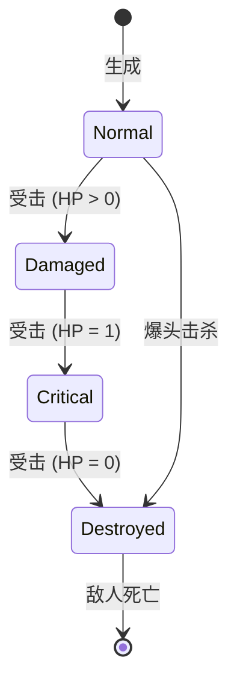
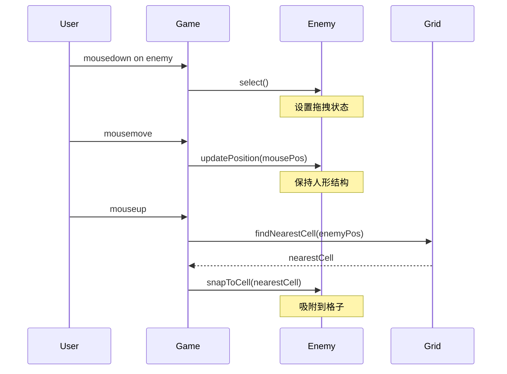
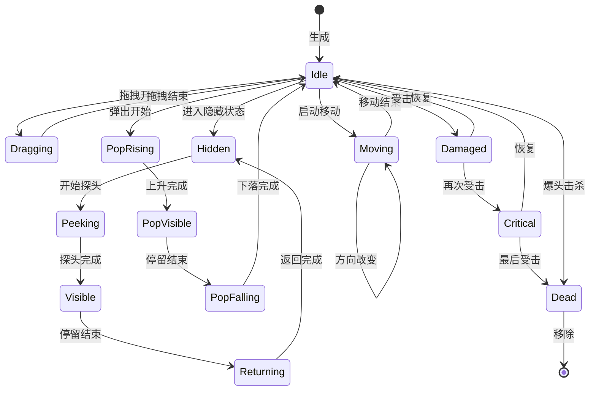
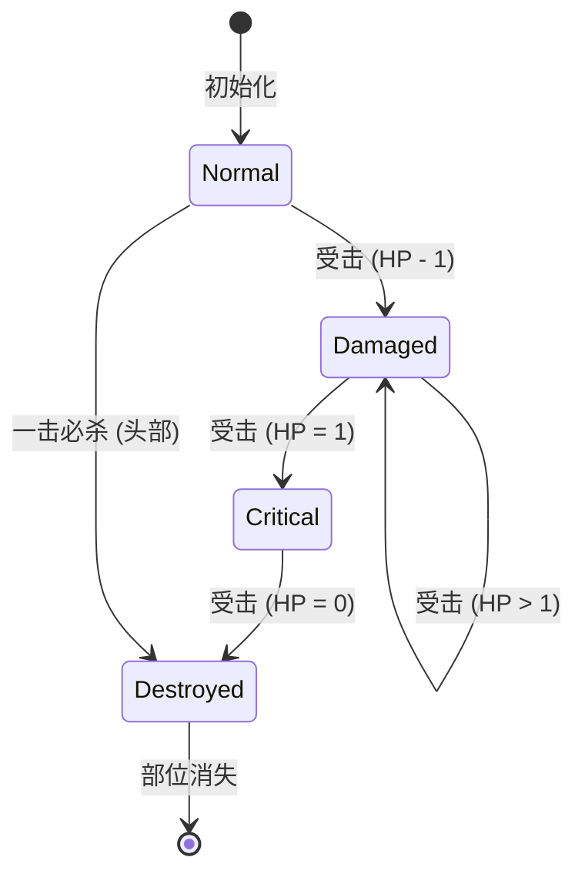
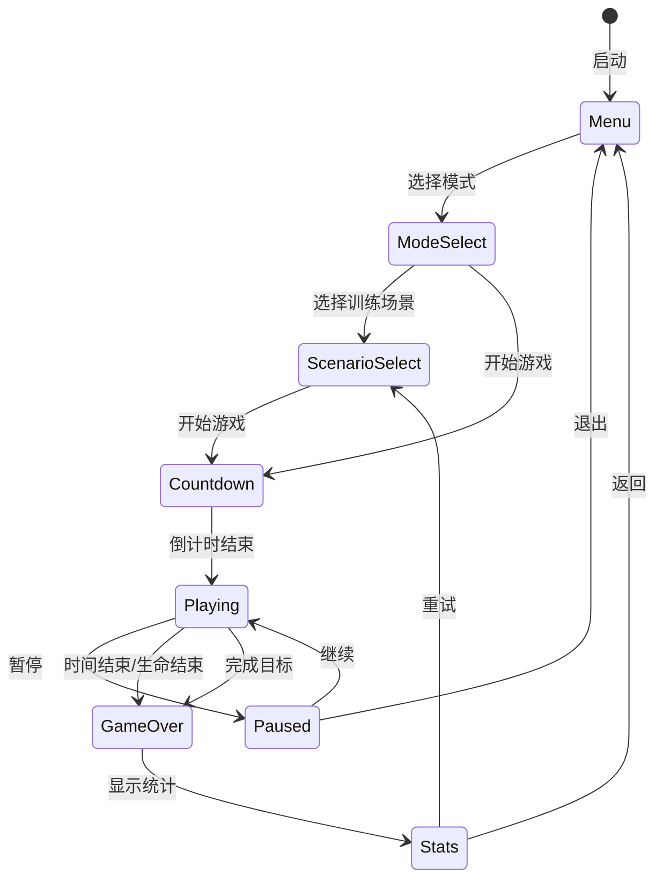
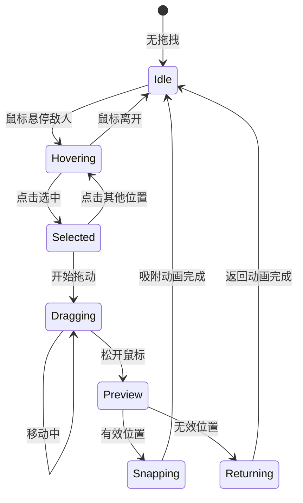
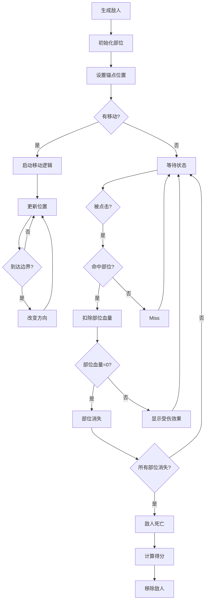
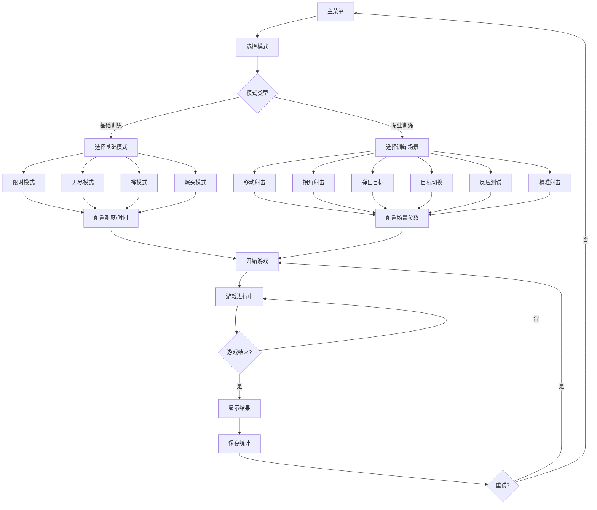
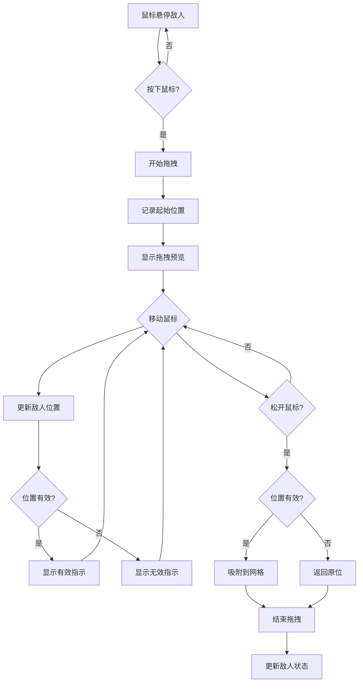

# Excel Aim Trainer - 组合格子敌人系统 + 专业 FPS 训练设计

> **文档版本**: v1.0  
> **创建日期**: 2026-03-27  
> **作者**: Claude (Subagent)

---

## 目录

1. [概述](#1-概述)
2. [组合格子敌人系统](#2-组合格子敌人系统)
3. [专业 FPS 训练模式](#3-专业-fps-训练模式)
4. [参考软件对比分析](#4-参考软件对比分析)
5. [Excel 风格实现方案](#5-excel-风格实现方案)
6. [数据结构定义](#6-数据结构定义)
7. [状态机设计](#7-状态机设计)
8. [拖拽算法](#8-拖拽算法)
9. [评分算法](#9-评分算法)
10. [实现优先级与工时估计](#10-实现优先级与工时估计)

---

## 1. 概述

### 1.1 设计目标

将现有的单格目标系统升级为 **组合格子敌人系统**，同时引入专业 FPS 训练软件的核心训练模式，打造一款既保持 Excel 独特风格，又具备专业训练价值的瞄准训练器。

### 1.2 核心创新点

| 功能 | 描述 | 参考来源 |
|------|------|----------|
| 组合敌人 | 5 格组成人形，部位独立血量 | KovaaK's + 原创设计 |
| 部位训练 | 针对性击打头部/身体/手/脚 | Aim Lab |
| 移动射击 | 敌人沿路径移动，训练跟枪 | Aim Lab Motion Track |
| 拐角射击 | 敌人从掩体探头，训练预瞄 | Aim Lab Peek Shot |
| 掩体训练 | 敌人从掩体后弹出 | KovaaK's Popcorn |
| 目标切换 | 多目标优先级射击 | Aim Lab Switch Track |
| 反应测试 | 纯反应时间测量 | Human Benchmark |

### 1.3 现有系统分析

当前系统支持：
- ✅ 单格目标 (head/body/feet)
- ✅ 基础游戏模式 (timed/endless/zen/headshot)
- ✅ 连击系统
- ✅ 难度配置
- ✅ 基础统计

需要升级：
- ⬆️ 单格目标 → 组合格子敌人
- ⬆️ 固定目标 → 移动目标
- ⬆️ 简单生成 → 训练场景系统
- ⬆️ 基础统计 → 专业数据分析

---

## 2. 组合格子敌人系统

### 2.1 敌人结构

一个完整敌人由 **5 个格子** 组成人形：

```
    ┌─────┐
    │ 头  │     ← 第1行 (1格) - 锚点位置
    └─────┘
┌─────┬─────┬─────┐
│左手 │ 身体│右手 │     ← 第2行 (3格)
└─────┴─────┴─────┘
    ┌─────┐
    │ 身体│     ← 第3行 (1格，与第2行身体连通)
    └─────┘
    ┌─────┐
    │ 脚  │     ← 第4行 (1格)
    └─────┘
```

**锚点定义**: 头部位置为敌人锚点，其他部位相对锚点定位。

### 2.2 部位系统

#### 2.2.1 部位属性

| 部位 | 英文 | 血量 | 分值 | 受伤效果 | 击破效果 |
|------|------|------|------|----------|----------|
| 头 | head | 1 | 150 | 立即消失 | 敌人死亡 |
| 身体 | body | 3 | 100/击 | 变红→闪烁 | 移动减速 |
| 左手 | leftHand | 2 | 60/击 | 变红→闪烁 | 无法使用双手动作 |
| 右手 | rightHand | 2 | 60/击 | 变红→闪烁 | 无法使用双手动作 |
| 脚 | foot | 2 | 40/击 | 变红→闪烁 | 移动速度降低 |

#### 2.2.2 部位视觉效果

```typescript
// 部位状态颜色映射
const PART_STATE_COLORS = {
  normal: {
    head: '#dc2626',    // 红色
    body: '#f97316',    // 橙色
    leftHand: '#eab308', // 黄色
    rightHand: '#eab308',
    foot: '#6b7280',     // 灰色
  },
  damaged: {
    head: '#dc2626',    // 保持原色但透明度变化
    body: '#ef4444',    // 更红的红色
    leftHand: '#fbbf24',
    rightHand: '#fbbf24',
    foot: '#9ca3af',
  },
  critical: {
    head: '#dc2626',
    body: '#ff0000',    // 闪烁红色
    leftHand: '#ff6b6b',
    rightHand: '#ff6b6b',
    foot: '#ff6b6b',
  },
  destroyed: '#6b7280', // 灰色，半透明
};
```

### 2.3 受击与血量系统

#### 2.3.1 受击状态



#### 2.3.2 部位血量管理

```typescript
interface PartHealth {
  type: PartType;
  maxHp: number;
  currentHp: number;
  state: 'normal' | 'damaged' | 'critical' | 'destroyed';
}

// 初始化部位血量
function initPartHealth(partType: PartType): PartHealth {
  const maxHpMap: Record<PartType, number> = {
    head: 1,
    body: 3,
    leftHand: 2,
    rightHand: 2,
    foot: 2,
  };
  
  return {
    type: partType,
    maxHp: maxHpMap[partType],
    currentHp: maxHpMap[partType],
    state: 'normal',
  };
}
```

### 2.4 拖拽系统

#### 2.4.1 拖拽流程



#### 2.4.2 拖拽算法伪代码

```typescript
// 拖拽管理器
class DragManager {
  private draggedEnemy: CompositeEnemy | null = null;
  private dragOffset: { row: number; col: number } = { row: 0, col: 0 };
  
  // 开始拖拽
  startDrag(enemy: CompositeEnemy, mouseRow: number, mouseCol: number): void {
    this.draggedEnemy = enemy;
    // 计算鼠标位置与敌人锚点的偏移
    this.dragOffset = {
      row: mouseRow - enemy.anchorRow,
      col: mouseCol - enemy.anchorCol,
    };
    enemy.setState('dragging');
  }
  
  // 更新拖拽位置
  updateDrag(mouseRow: number, mouseCol: number): void {
    if (!this.draggedEnemy) return;
    
    // 计算新的锚点位置
    const newAnchorRow = mouseRow - this.dragOffset.row;
    const newAnchorCol = mouseCol - this.dragOffset.col;
    
    // 边界检查 - 确保敌人完整显示在网格内
    const { minRow, maxRow, minCol, maxCol } = this.getBounds(this.draggedEnemy);
    const clampedRow = Math.max(1 - minRow, Math.min(ROWS - maxRow, newAnchorRow));
    const clampedCol = Math.max(2 - minCol, Math.min(COLS - maxCol + 1, newAnchorCol));
    
    this.draggedEnemy.setPosition(clampedRow, clampedCol);
  }
  
  // 结束拖拽 - 吸附到最近格子
  endDrag(): void {
    if (!this.draggedEnemy) return;
    
    const enemy = this.draggedEnemy;
    // 吸附到最近的格子中心
    const snappedRow = Math.round(enemy.anchorRow);
    const snappedCol = Math.round(enemy.anchorCol);
    
    enemy.setPosition(snappedRow, snappedCol);
    enemy.setState('idle');
    
    this.draggedEnemy = null;
  }
  
  // 获取敌人相对锚点的边界
  private getBounds(enemy: CompositeEnemy): { minRow: number; maxRow: number; minCol: number; maxCol: number } {
    // 完整人形: 行范围 -1 到 2，列范围 -1 到 1
    return {
      minRow: -1,  // 手部位可能向上偏移
      maxRow: 2,   // 脚部向下
      minCol: -1,  // 左手
      maxCol: 1,   // 右手
    };
  }
}
```

### 2.5 加分系统

#### 2.5.1 分数计算公式

```
最终得分 = 基础分 × 部位倍率 × 连击倍率 × 难度倍率 × 时间奖励 × 精准奖励
```

#### 2.5.2 详细分值表

| 击中类型 | 基础分 | 条件 |
|----------|--------|------|
| 头部命中 | 150 | 单次命中即击破 |
| 身体命中 | 100 | 每次命中 |
| 手部命中 | 60 | 每次命中 |
| 脚部命中 | 40 | 每次命中 |
| 爆头击杀 | +200 | 敌人总血量 > 0 时爆头 |
| 快速击杀 | +100 | 3秒内消灭完整敌人 |
| 完美击杀 | +150 | 无失误消灭敌人 |
| 部位连击 | +50 | 连续击中同一部位 3 次 |

#### 2.5.3 连击系统

```typescript
// 连击倍率计算
function getComboMultiplier(combo: number): number {
  const COMBO_MULTIPLIERS = [
    { threshold: 0, multiplier: 1.0 },
    { threshold: 5, multiplier: 1.2 },
    { threshold: 10, multiplier: 1.5 },
    { threshold: 20, multiplier: 2.0 },
    { threshold: 30, multiplier: 2.5 },
    { threshold: 50, multiplier: 3.0 },
    { threshold: 75, multiplier: 3.5 },
    { threshold: 100, multiplier: 4.0 },
  ];
  
  for (let i = COMBO_MULTIPLIERS.length - 1; i >= 0; i--) {
    if (combo >= COMBO_MULTIPLIERS[i].threshold) {
      return COMBO_MULTIPLIERS[i].multiplier;
    }
  }
  return 1.0;
}

// 难度倍率
const DIFFICULTY_MULTIPLIERS: Record<Difficulty, number> = {
  easy: 0.8,
  normal: 1.0,
  hard: 1.3,
  expert: 1.6,
};
```

---

## 3. 专业 FPS 训练模式

### 3.1 模式概览

| 模式 | 训练目标 | 参考来源 | 难度范围 |
|------|----------|----------|----------|
| Motion Track | 跟枪射击 | Aim Lab | ★★☆☆☆ ~ ★★★★★ |
| Peek Shot | 拐角预瞄 | Aim Lab | ★☆☆☆☆ ~ ★★★★☆ |
| Popcorn | 掩体反应 | KovaaK's | ★☆☆☆☆ ~ ★★★★★ |
| Switch Track | 目标切换 | Aim Lab | ★★☆☆☆ ~ ★★★★★ |
| Reaction Test | 纯反应 | Human Benchmark | ☆☆☆☆☆ |
| Precision | 精准射击 | Aim Lab | ★★★☆☆ ~ ★★★★★ |

### 3.2 移动射击训练 (Motion Track)

#### 3.2.1 设计目标

训练玩家追踪移动目标的能力，包括跟枪平滑度和预判能力。

#### 3.2.2 移动模式

```typescript
type MovePattern = 'linear' | 'sine' | 'bounce' | 'random' | 'zigzag';

interface MotionConfig {
  pattern: MovePattern;
  speed: number;         // 格/秒
  direction: 'left' | 'right' | 'up' | 'down' | 'diagonal';
  acceleration?: number; // 加速度
  path?: { row: number; col: number }[]; // 自定义路径点
}

// 移动模式实现
const MOVE_PATTERNS: Record<MovePattern, (t: number, config: MotionConfig) => Position> = {
  // 线性移动
  linear: (t, config) => ({
    row: config.startRow,
    col: config.startCol + (config.direction === 'left' ? -1 : 1) * config.speed * t,
  }),
  
  // 正弦波移动
  sine: (t, config) => ({
    row: config.startRow + Math.sin(t * 2) * 3,
    col: config.startCol + config.speed * t,
  }),
  
  // 弹跳移动
  bounce: (t, config) => {
    const bounceHeight = 5;
    const bounceFreq = 0.5;
    return {
      row: config.startRow + Math.abs(Math.sin(t * bounceFreq * Math.PI)) * bounceHeight,
      col: config.startCol + config.speed * t,
    };
  },
  
  // 随机游走
  random: (t, config) => {
    // 使用 Perlin noise 生成平滑随机路径
    return {
      row: config.startRow + noise(t * 0.5) * 5,
      col: config.startCol + config.speed * t,
    };
  },
  
  // 锯齿形移动
  zigzag: (t, config) => ({
    row: config.startRow + (Math.floor(t) % 2 === 0 ? 2 : -2),
    col: config.startCol + config.speed * t,
  }),
};
```

#### 3.2.3 评分系统

```typescript
interface MotionTrackScore {
  hits: number;
  misses: number;
  accuracy: number;
  
  // 跟枪评分
  trackingSmoothness: number; // 0-100，基于鼠标移动平滑度
  trackingAccuracy: number;    // 0-100，鼠标在目标上的时间比例
  
  // 速度评分
  avgReactionTime: number;     // 平均反应时间 ms
  fastHits: number;            // <200ms 命中次数
  slowHits: number;            // >500ms 命中次数
}

function calculateMotionScore(score: MotionTrackScore): number {
  const baseScore = score.hits * 100;
  const accuracyBonus = score.accuracy * 2;
  const smoothnessBonus = score.trackingSmoothness * 1.5;
  const speedBonus = score.fastHits * 50;
  
  return Math.floor(baseScore + accuracyBonus + smoothnessBonus + speedBonus);
}
```

### 3.3 拐角射击训练 (Peek Shot)

#### 3.3.1 设计目标

训练玩家在拐角预瞄和快速反应的能力。

#### 3.3.2 场景布局

```
┌────────────────────────────────────────┐
│                                        │
│    ┌──────┐                            │
│    │掩体A │           [敌人]           │
│    │      │         ← 探头方向         │
│    └──────┘                            │
│                                        │
│              [玩家]                    │
│                                        │
└────────────────────────────────────────┘
```

#### 3.3.3 探头逻辑

```typescript
interface PeekConfig {
  coverPosition: { row: number; col: number };  // 掩体位置
  peekDirection: 'left' | 'right' | 'up' | 'down';
  peekDistance: number;      // 探头距离（格）
  peekDuration: number;      // 停留时间 ms
  peekInterval: number;      // 探头间隔 ms
  peekPause: number;         // 探头后暂停 ms
}

// 探头状态机
type PeekState = 'hidden' | 'peeking' | 'visible' | 'returning';

function updatePeekEnemy(enemy: PeekEnemy, deltaTime: number): void {
  switch (enemy.peekState) {
    case 'hidden':
      enemy.stateTimer += deltaTime;
      if (enemy.stateTimer >= enemy.config.peekInterval) {
        enemy.peekState = 'peeking';
        enemy.stateTimer = 0;
      }
      break;
      
    case 'peeking':
      // 探头动画
      enemy.peekProgress += deltaTime / PEEK_ANIMATION_DURATION;
      if (enemy.peekProgress >= 1) {
        enemy.peekState = 'visible';
        enemy.stateTimer = 0;
        enemy.peekProgress = 1;
      }
      break;
      
    case 'visible':
      enemy.stateTimer += deltaTime;
      if (enemy.stateTimer >= enemy.config.peekDuration) {
        enemy.peekState = 'returning';
        enemy.stateTimer = 0;
      }
      break;
      
    case 'returning':
      enemy.peekProgress -= deltaTime / PEEK_ANIMATION_DURATION;
      if (enemy.peekProgress <= 0) {
        enemy.peekState = 'hidden';
        enemy.stateTimer = 0;
        enemy.peekProgress = 0;
        // 随机下次探头方向
        enemy.config.peekDirection = randomPeekDirection();
      }
      break;
  }
}
```

#### 3.3.4 评分系统

```typescript
interface PeekShotScore {
  hits: number;
  misses: number;
  avgReactionTime: number;
  bestReactionTime: number;
  hitDuringPeek: number;    // 探头期间命中
  hitDuringReturn: number;  // 返回期间命中
  missedOpportunities: number; // 错过的探头次数
}

function calculatePeekScore(score: PeekShotScore): number {
  const hitScore = score.hits * 150;
  const reactionBonus = Math.max(0, 500 - score.avgReactionTime) * 0.5;
  const peekBonus = score.hitDuringPeek * 50;
  const penalty = score.missedOpportunities * 30;
  
  return Math.floor(hitScore + reactionBonus + peekBonus - penalty);
}
```

### 3.4 掩体内敌人训练 (Popcorn)

#### 3.4.1 设计目标

训练玩家快速定位和射击从掩体后弹出的目标。

#### 3.4.2 弹出逻辑

```typescript
interface PopcornConfig {
  covers: CoverConfig[];     // 掩体配置
  popHeight: 'half' | 'full'; // 弹出高度
  popDuration: number;       // 弹出持续时间 ms
  popInterval: number;       // 弹出间隔 ms
  maxActive: number;        // 最大同时弹出数
}

interface CoverConfig {
  id: string;
  position: { row: number; col: number };
  size: { width: number; height: number };
  material: 'wood' | 'stone' | 'metal'; // 不同材质，影响视觉效果
  destructible: boolean;     // 是否可破坏
  health?: number;           // 掩体血量
}

// 弹出状态
type PopState = 'hidden' | 'rising' | 'visible' | 'falling';

function updatePopcornEnemy(enemy: PopcornEnemy, deltaTime: number): void {
  switch (enemy.popState) {
    case 'hidden':
      // 等待随机弹出
      enemy.stateTimer += deltaTime;
      if (enemy.stateTimer >= enemy.nextPopTime) {
        enemy.popState = 'rising';
        enemy.stateTimer = 0;
      }
      break;
      
    case 'rising':
      enemy.popProgress += deltaTime / POP_RISE_DURATION;
      if (enemy.popProgress >= 1) {
        enemy.popState = 'visible';
        enemy.stateTimer = 0;
        enemy.popProgress = 1;
      }
      break;
      
    case 'visible':
      enemy.stateTimer += deltaTime;
      if (enemy.stateTimer >= enemy.config.popDuration) {
        enemy.popState = 'falling';
        enemy.stateTimer = 0;
      }
      break;
      
    case 'falling':
      enemy.popProgress -= deltaTime / POP_FALL_DURATION;
      if (enemy.popProgress <= 0) {
        enemy.popState = 'hidden';
        enemy.stateTimer = 0;
        enemy.popProgress = 0;
        enemy.nextPopTime = randomInterval();
      }
      break;
  }
}
```

### 3.5 多目标切换训练 (Switch Track)

#### 3.5.1 设计目标

训练玩家快速切换目标和识别优先级的能力。

#### 3.5.2 目标优先级系统

```typescript
type Priority = 'critical' | 'high' | 'medium' | 'low';

interface SwitchTarget extends CompositeEnemy {
  priority: Priority;
  priorityIcon: string; // 显示的优先级图标
  spawnTime: number;
  timeLimit: number;    // 消失时间限制
}

// 优先级生成
function generatePriorityTargets(count: number): SwitchTarget[] {
  const priorities: Priority[] = ['critical', 'high', 'medium', 'low'];
  const targets: SwitchTarget[] = [];
  
  for (let i = 0; i < count; i++) {
    const priority = priorities[Math.floor(Math.random() * priorities.length)];
    targets.push({
      ...generateCompositeEnemy(),
      priority,
      priorityIcon: getPriorityIcon(priority),
      spawnTime: Date.now(),
      timeLimit: getPriorityTimeLimit(priority),
    });
  }
  
  return targets;
}

function getPriorityTimeLimit(priority: Priority): number {
  switch (priority) {
    case 'critical': return 1500; // 1.5秒
    case 'high': return 2500;     // 2.5秒
    case 'medium': return 4000;   // 4秒
    case 'low': return 6000;      // 6秒
  }
}

function getPriorityIcon(priority: Priority): string {
  switch (priority) {
    case 'critical': return '🔴';
    case 'high': return '🟠';
    case 'medium': return '🟡';
    case 'low': return '🟢';
  }
}
```

#### 3.5.3 评分系统

```typescript
interface SwitchTrackScore {
  hits: number;
  misses: number;
  correctOrder: number;      // 按优先级顺序命中
  wrongOrder: number;        // 错误顺序
  avgSwitchTime: number;     // 平均切换时间
  fastSwitches: number;      // <300ms 切换
}

function calculateSwitchScore(score: SwitchTrackScore): number {
  const baseScore = score.hits * 100;
  const orderBonus = score.correctOrder * 75;
  const orderPenalty = score.wrongOrder * 50;
  const switchBonus = score.fastSwitches * 25;
  
  return Math.floor(baseScore + orderBonus - orderPenalty + switchBonus);
}
```

### 3.6 反应训练 (Reaction Test)

#### 3.6.1 设计目标

测量玩家的纯反应时间。

#### 3.6.2 实现逻辑

```typescript
interface ReactionTest {
  state: 'waiting' | 'ready' | 'showing' | 'result' | 'early';
  targetAppearTime: number;
  reactionTimes: number[];
  currentRound: number;
  totalRounds: number;
}

function handleReactionClick(test: ReactionTest): ReactionResult {
  const now = Date.now();
  
  switch (test.state) {
    case 'waiting':
      // 点击太早
      return { type: 'early', penalty: true };
      
    case 'showing':
      // 正常反应
      const reactionTime = now - test.targetAppearTime;
      test.reactionTimes.push(reactionTime);
      return { type: 'hit', reactionTime };
      
    default:
      return { type: 'invalid' };
  }
}

function calculateReactionStats(times: number[]): ReactionStats {
  const sorted = [...times].sort((a, b) => a - b);
  return {
    avg: times.reduce((a, b) => a + b, 0) / times.length,
    min: sorted[0],
    max: sorted[sorted.length - 1],
    median: sorted[Math.floor(sorted.length / 2)],
    p10: sorted[Math.floor(sorted.length * 0.1)],
    p90: sorted[Math.floor(sorted.length * 0.9)],
    consistency: calculateConsistency(times),
  };
}

// 一致性评分（标准差越小越好）
function calculateConsistency(times: number[]): number {
  const avg = times.reduce((a, b) => a + b, 0) / times.length;
  const variance = times.reduce((sum, t) => sum + Math.pow(t - avg, 2), 0) / times.length;
  const stdDev = Math.sqrt(variance);
  
  // 标准差越小，一致性越高
  return Math.max(0, 100 - stdDev / 10);
}
```

### 3.7 精准度训练 (Precision)

#### 3.7.1 设计目标

训练玩家对微小目标的精准射击能力。

#### 3.7.2 目标配置

```typescript
interface PrecisionConfig {
  targetSize: 'micro' | 'small' | 'normal'; // 格子大小比例
  distance: 'close' | 'medium' | 'far' | 'extreme';
  movement: 'static' | 'slow' | 'medium' | 'fast';
  targetCount: number;
}

const PRECISION_SETTINGS: Record<string, PrecisionConfig> = {
  micro_static: {
    targetSize: 'micro',    // 0.25 格
    distance: 'medium',
    movement: 'static',
    targetCount: 3,
  },
  micro_moving: {
    targetSize: 'micro',
    distance: 'medium',
    movement: 'slow',
    targetCount: 2,
  },
  small_far: {
    targetSize: 'small',    // 0.5 格
    distance: 'far',
    movement: 'static',
    targetCount: 5,
  },
  // ...更多配置
};

// 目标大小到像素的映射
const SIZE_TO_PIXELS: Record<string, number> = {
  micro: 8,   // 8px
  small: 16,  // 16px
  normal: 32, // 32px (标准格子大小)
};
```

---

## 4. 参考软件对比分析

### 4.1 Aim Lab

| 特性 | 描述 | 可借鉴点 |
|------|------|----------|
| 训练模式 | 50+ 种训练场景 | 模式分类系统 |
| 数据追踪 | 详细统计数据 | 性能曲线图 |
| AI 分析 | 识别弱点并推荐训练 | 智能训练推荐 |
| 自定义 | 可创建自定义场景 | 场景编辑器 |

**核心训练模式提取**:

1. **Motion Track** - 跟踪移动目标
2. **Peek Shot** - 拐角预瞄
3. **Switch Track** - 目标切换
4. **Precision** - 精准射击
5. **Spidershot** - 多方向目标
6. **Microshot** - 微小目标

**评分算法分析**:

```typescript
// Aim Lab 评分公式（逆向工程估算）
function aimLabScore(params: {
  accuracy: number;
  reactionTime: number;
  trackingSmoothness: number;
  targetCount: number;
}): number {
  // 准确率权重 40%
  const accuracyScore = params.accuracy * 40;
  
  // 反应时间权重 30%
  const reactionScore = Math.max(0, 500 - params.reactionTime) * 0.06;
  
  // 平滑度权重 20%
  const smoothnessScore = params.trackingSmoothness * 0.2;
  
  // 目标完成度权重 10%
  const completionScore = (params.targetCount / MAX_TARGETS) * 10;
  
  return Math.floor(accuracyScore + reactionScore + smoothnessScore + completionScore);
}
```

### 4.2 KovaaK's FPS Aim Trainer

| 特性 | 描述 | 可借鉴点 |
|------|------|----------|
| 场景丰富 | 1000+ 社区场景 | 场景导入系统 |
| 音乐同步 | 目标随音乐节奏移动 | 节奏训练模式 |
| 统计详尽 | 详细性能分析 | 进步曲线 |
| 练习计划 | 预设练习计划 | 训练计划系统 |

**核心训练模式提取**:

1. **Popcorn** - 弹出目标
2. **Tracking** - 跟踪射击
3. **Clicking** - 点击精准
4. **Switching** - 目标切换
5. **Dodging** - 躲避射击

### 4.3 Human Benchmark

| 特性 | 描述 | 可借鉴点 |
|------|------|----------|
| 反应测试 | 纯反应时间测量 | 反应训练模式 |
| 简洁界面 | 无干扰测试环境 | 极简训练界面 |
| 百分位排名 | 与全球玩家对比 | 排名系统 |

**反应测试流程**:

```
等待 → 红色屏幕 → 随机延迟 → 绿色屏幕 → 点击 → 显示时间
     (不要点击)      (等待)       (立即点击)
```

### 4.4 功能对比矩阵

| 功能 | Aim Lab | KovaaK's | 3D Aim Trainer | 本设计 |
|------|---------|----------|----------------|--------|
| 移动目标 | ✅ | ✅ | ✅ | ✅ |
| 拐角预瞄 | ✅ | ✅ | ❌ | ✅ |
| 目标切换 | ✅ | ✅ | ✅ | ✅ |
| 反应测试 | ✅ | ❌ | ✅ | ✅ |
| 精准训练 | ✅ | ✅ | ✅ | ✅ |
| 组合敌人 | ❌ | 部分 | ❌ | ✅ |
| 部位训练 | ❌ | ❌ | ❌ | ✅ |
| Excel 风格 | ❌ | ❌ | ❌ | ✅ |
| 拖拽系统 | ❌ | ❌ | ❌ | ✅ |

---

## 5. Excel 风格实现方案

### 5.1 视觉风格

#### 5.1.1 敌人显示

```typescript
// Excel 风格敌人渲染
const EXCEL_ENEMY_STYLE = {
  // 文字模式
  text: {
    head: '头',
    body: '身',
    leftHand: '手',
    rightHand: '手',
    foot: '脚',
  },
  
  // 颜色方案（基于 Excel 条件格式）
  colors: {
    normal: {
      head: 'bg-red-100 border-red-500 text-red-700',
      body: 'bg-orange-100 border-orange-500 text-orange-700',
      leftHand: 'bg-yellow-100 border-yellow-500 text-yellow-700',
      rightHand: 'bg-yellow-100 border-yellow-500 text-yellow-700',
      foot: 'bg-gray-100 border-gray-500 text-gray-700',
    },
    damaged: {
      // 更深的背景色
      head: 'bg-red-300 border-red-600 text-red-800',
      body: 'bg-orange-300 border-orange-600 text-orange-800',
      // ...
    },
    critical: {
      // 闪烁效果（CSS animation）
      common: 'animate-pulse bg-red-400 border-red-700',
    },
    destroyed: {
      // 半透明灰色
      common: 'bg-gray-200 border-gray-400 text-gray-400 opacity-50',
    },
  },
  
  // 单元格样式
  cell: {
    border: '1px solid #d1d5db',
    fontFamily: 'Calibri, "微软雅黑", sans-serif',
    fontSize: '11px',
    textAlign: 'center',
    verticalAlign: 'middle',
  },
};
```

#### 5.1.2 掩体显示

```typescript
// Excel 风格掩体
interface ExcelCover {
  cells: { row: number; col: number }[];
  material: 'wood' | 'stone' | 'metal';
  health: number;
  maxHealth: number;
}

const COVER_STYLES = {
  wood: {
    background: 'linear-gradient(135deg, #d4a574 0%, #8b5a2b 100%)',
    border: '2px solid #5d3a1a',
    pattern: 'repeating-linear-gradient(45deg, transparent, transparent 2px, rgba(0,0,0,0.1) 2px, rgba(0,0,0,0.1) 4px)',
  },
  stone: {
    background: 'linear-gradient(135deg, #9ca3af 0%, #4b5563 100%)',
    border: '2px solid #374151',
    pattern: 'url("data:image/svg+xml,...")', // 石头纹理
  },
  metal: {
    background: 'linear-gradient(135deg, #e5e7eb 0%, #6b7280 100%)',
    border: '2px solid #374151',
    pattern: 'repeating-linear-gradient(90deg, transparent, transparent 4px, rgba(255,255,255,0.3) 4px, rgba(255,255,255,0.3) 8px)',
  },
};
```

### 5.2 拖拽实现

#### 5.2.1 Excel 风格拖拽效果

```css
/* 拖拽时的视觉反馈 */
.enemy-dragging {
  opacity: 0.8;
  transform: scale(1.05);
  box-shadow: 0 4px 12px rgba(0, 0, 0, 0.3);
  cursor: grabbing !important;
  z-index: 1000;
}

/* 拖拽预览（显示敌人将被放置的位置） */
.enemy-drop-preview {
  opacity: 0.4;
  border: 2px dashed #3b82f6;
  background: rgba(59, 130, 246, 0.1);
}

/* 拖拽轨迹线 */
.drag-trail {
  position: absolute;
  pointer-events: none;
  border-left: 2px dashed #9ca3af;
  opacity: 0.5;
}

/* 吸附动画 */
.enemy-snap {
  transition: all 0.15s cubic-bezier(0.4, 0, 0.2, 1);
}
```

#### 5.2.2 拖拽交互流程

```typescript
// Excel 风格拖拽交互
const EXCEL_DRAG_INTERACTION = {
  // 1. 选中
  select: {
    cursor: 'pointer',
    hoverEffect: 'brightness(1.1)',
    outline: '2px solid #3b82f6',
  },
  
  // 2. 拖拽开始
  dragStart: {
    cursor: 'grabbing',
    opacity: 0.8,
    scale: 1.05,
    shadow: '0 8px 24px rgba(0, 0, 0, 0.2)',
  },
  
  // 3. 拖拽中
  dragging: {
    showPreview: true,
    showTrail: false, // 可选
    constrainToGrid: true,
  },
  
  // 4. 拖拽结束
  dragEnd: {
    snapToNearestCell: true,
    animationDuration: 150, // ms
    animationEasing: 'cubic-bezier(0.4, 0, 0.2, 1)',
  },
  
  // 5. 无效放置
  invalidDrop: {
    returnToOriginal: true,
    animationDuration: 200,
    showFeedback: true,
    feedbackColor: '#ef4444',
  },
};
```

### 5.3 训练场景

#### 5.3.1 场景定义

```typescript
interface TrainingScenario {
  id: string;
  name: string;
  description: string;
  mode: GameMode;
  difficulty: Difficulty;
  
  // 场景布局
  layout: {
    covers?: ExcelCover[];     // 掩体
    walls?: WallConfig[];      // 墙壁
    spawnZones?: SpawnZone[];   // 生成区域
    pathLines?: PathLine[];    // 移动路径
  };
  
  // 敌人配置
  enemies: {
    type: 'single' | 'composite';
    count: number;
    spawnRate: number;
    movePattern?: MovePattern;
    peekConfig?: PeekConfig;
  };
  
  // 训练目标
  objectives: TrainingObjective[];
  
  // 时间限制
  timeLimit?: number;
  
  // 解锁条件
  unlockCondition?: UnlockCondition;
}

// 预设场景
const PRESET_SCENARIOS: TrainingScenario[] = [
  {
    id: 'basic_tracking',
    name: '基础跟枪',
    description: '追踪横向移动的目标',
    mode: 'moving_target',
    difficulty: 'easy',
    layout: {
      pathLines: [{ type: 'horizontal', y: 15, length: 20 }],
    },
    enemies: {
      type: 'composite',
      count: 1,
      spawnRate: 0,
      movePattern: 'linear',
    },
    objectives: [
      { type: 'hits', target: 30 },
      { type: 'accuracy', target: 70 },
    ],
    timeLimit: 60,
  },
  
  {
    id: 'peek_corner_1',
    name: '拐角预瞄 1',
    description: '练习拐角处的预瞄射击',
    mode: 'peek_shot',
    difficulty: 'easy',
    layout: {
      covers: [
        { position: { row: 10, col: 5 }, size: { width: 3, height: 8 }, material: 'stone' },
      ],
    },
    enemies: {
      type: 'composite',
      count: 1,
      spawnRate: 2000,
      peekConfig: {
        peekDuration: 1500,
        peekInterval: 3000,
      },
    },
    objectives: [
      { type: 'hits', target: 15 },
      { type: 'avgReaction', target: 400 },
    ],
    timeLimit: 120,
  },
  
  // 更多场景...
];
```

---

## 6. 数据结构定义

### 6.1 核心类型

```typescript
// ============================================================
// 组合敌人类型定义
// ============================================================

/** 部位类型 */
export type PartType = 'head' | 'body' | 'leftHand' | 'rightHand' | 'foot';

/** 部位状态 */
export type PartState = 'normal' | 'damaged' | 'critical' | 'destroyed';

/** 敌人状态 */
export type EnemyState = 'idle' | 'dragging' | 'moving' | 'peeking' | 'hidden' | 'dead';

/** 移动模式 */
export type MovePattern = 'static' | 'linear' | 'sine' | 'bounce' | 'random' | 'zigzag' | 'path';

/** 探头方向 */
export type PeekDirection = 'left' | 'right' | 'up' | 'down';

/** 弹出状态 */
export type PopState = 'hidden' | 'rising' | 'visible' | 'falling';

/** 优先级 */
export type Priority = 'critical' | 'high' | 'medium' | 'low';

/** 游戏模式（扩展） */
export type GameMode = 
  | 'timed' 
  | 'endless' 
  | 'zen' 
  | 'headshot' 
  | 'part_training'
  | 'motion_track'     // 移动射击
  | 'peek_shot'        // 拐角射击
  | 'popcorn'          // 掩体弹出
  | 'switch_track'     // 目标切换
  | 'reaction'         // 反应测试
  | 'precision';       // 精准射击

// ============================================================
// 部位接口
// ============================================================

/** 部位配置 */
export interface PartConfig {
  type: PartType;
  maxHp: number;
  baseScore: number;
  color: string;
  text: string;
}

/** 部位状态 */
export interface PartState {
  type: PartType;
  maxHp: number;
  currentHp: number;
  state: PartState;
  position: {
    relativeRow: number;
    relativeCol: number;
  };
}

/** 部位命中结果 */
export interface PartHitResult {
  partType: PartType;
  damage: number;
  isDestroyed: boolean;
  isEnemyDead: boolean;
  score: number;
  combo: number;
}

// ============================================================
// 组合敌人接口
// ============================================================

/** 完整敌人形状 */
export interface EnemyShape {
  head: { rowOffset: number; colOffset: number };
  body: { rowOffset: number; colOffset: number }[];
  leftHand: { rowOffset: number; colOffset: number } | null;
  rightHand: { rowOffset: number; colOffset: number } | null;
  foot: { rowOffset: number; colOffset: number } | null;
}

/** 组合敌人 */
export interface CompositeEnemy {
  id: string;
  anchorRow: number;
  anchorCol: number;
  shape: EnemyShape;
  parts: Map<PartType, PartState>;
  state: EnemyState;
  createdAt: number;
  expiresAt?: number;
  
  // 移动相关
  movePattern?: MovePattern;
  moveConfig?: MoveConfig;
  moveProgress?: number;
  
  // 探头相关
  peekState?: PeekState;
  peekConfig?: PeekConfig;
  peekProgress?: number;
  
  // 弹出相关
  popState?: PopState;
  popProgress?: number;
  
  // 优先级（用于 Switch Track）
  priority?: Priority;
  spawnTime?: number;
  timeLimit?: number;
  
  // 统计
  totalDamageDealt: number;
  partsDestroyed: number;
}

/** 移动配置 */
export interface MoveConfig {
  pattern: MovePattern;
  speed: number;
  direction: 'left' | 'right' | 'up' | 'down' | 'diagonal';
  acceleration?: number;
  path?: { row: number; col: number }[];
  startRow: number;
  startCol: number;
}

/** 探头配置 */
export interface PeekConfig {
  coverPosition: { row: number; col: number };
  peekDirection: PeekDirection;
  peekDistance: number;
  peekDuration: number;
  peekInterval: number;
  peekPause: number;
}

/** 掩体配置 */
export interface CoverConfig {
  id: string;
  position: { row: number; col: number };
  size: { width: number; height: number };
  material: 'wood' | 'stone' | 'metal';
  destructible: boolean;
  health?: number;
}

// ============================================================
// 训练场景接口
// ============================================================

/** 训练目标 */
export interface TrainingObjective {
  type: 'score' | 'accuracy' | 'combo' | 'headshots' | 'hits' | 'avgReaction' | 'time';
  target: number;
  current?: number;
  completed?: boolean;
}

/** 生成区域 */
export interface SpawnZone {
  id: string;
  bounds: { minRow: number; maxRow: number; minCol: number; maxCol: number };
  weight: number;
}

/** 移动路径 */
export interface PathLine {
  type: 'horizontal' | 'vertical' | 'diagonal' | 'custom';
  y?: number;
  x?: number;
  length: number;
  points?: { row: number; col: number }[];
}

/** 训练场景 */
export interface TrainingScenario {
  id: string;
  name: string;
  description: string;
  mode: GameMode;
  difficulty: Difficulty;
  layout: {
    covers?: CoverConfig[];
    walls?: WallConfig[];
    spawnZones?: SpawnZone[];
    pathLines?: PathLine[];
  };
  enemies: {
    type: 'single' | 'composite';
    count: number;
    spawnRate: number;
    movePattern?: MovePattern;
    peekConfig?: PeekConfig;
  };
  objectives: TrainingObjective[];
  timeLimit?: number;
  unlockCondition?: UnlockCondition;
}

/** 墙壁配置 */
export interface WallConfig {
  id: string;
  position: { row: number; col: number };
  size: { width: number; height: number };
  color?: string;
}

/** 解锁条件 */
export interface UnlockCondition {
  type: 'score' | 'level' | 'scenario';
  targetId: string;
  requirement: number;
}

// ============================================================
// 扩展游戏状态
// ============================================================

/** 扩展游戏状态 */
export interface ExtendedGameState extends GameState {
  // 组合敌人
  compositeEnemies: CompositeEnemy[];
  
  // 当前场景
  currentScenario?: TrainingScenario;
  
  // 掩体
  covers: CoverConfig[];
  
  // 训练统计
  trainingStats: {
    // 移动射击
    trackingSmoothness: number;
    trackingAccuracy: number;
    
    // 探头射击
    avgReactionTime: number;
    bestReactionTime: number;
    peekHits: number;
    
    // 目标切换
    correctOrderHits: number;
    wrongOrderHits: number;
    avgSwitchTime: number;
    
    // 反应测试
    reactionTimes: number[];
    earlyClicks: number;
  };
  
  // 精度统计
  precisionStats: {
    microHits: number;
    microMisses: number;
    avgHitDistance: number; // 命中点距目标中心的平均距离
  };
}

/** 扩展游戏设置 */
export interface ExtendedGameSettings extends GameSettings {
  // 移动目标设置
  enemyMoveSpeed: number;
  enemyMovePattern: MovePattern;
  enemyRenderMode: 'text' | 'icon' | 'minimal';
  
  // 训练模式设置
  showPriorityIcons: boolean;
  showReactionTime: boolean;
  showTrackingIndicator: boolean;
  
  // 场景编辑器
  customScenarios: TrainingScenario[];
  
  // 关卡进度
  unlockedLevels: number[];
  unlockedScenarios: string[];
  credits: number;
}

/** 扩展游戏统计 */
export interface ExtendedGameStats extends GameStats {
  // 训练模式统计
  trainingModeStats: {
    motionTrack: MotionTrackStats;
    peekShot: PeekShotStats;
    popcorn: PopcornStats;
    switchTrack: SwitchTrackStats;
    reaction: ReactionStats;
    precision: PrecisionStats;
  };
  
  // 总体训练数据
  totalTrainingTime: number;
  skillRatings: {
    tracking: number;    // 跟枪能力
    flicking: number;    // 甩枪能力
    precision: number;   // 精准度
    reaction: number;    // 反应速度
    switching: number;   // 目标切换
  };
  
  // 进步曲线
  progressHistory: ProgressEntry[];
}

/** 移动射击统计 */
export interface MotionTrackStats {
  gamesPlayed: number;
  avgAccuracy: number;
  avgSmoothness: number;
  bestSmoothness: number;
  avgTrackingAccuracy: number;
  totalHits: number;
  totalMisses: number;
}

/** 探头射击统计 */
export interface PeekShotStats {
  gamesPlayed: number;
  avgReactionTime: number;
  bestReactionTime: number;
  avgAccuracy: number;
  peekHits: number;
  missedOpportunities: number;
}

/** 弹出目标统计 */
export interface PopcornStats {
  gamesPlayed: number;
  avgAccuracy: number;
  avgReactionTime: number;
  totalPops: number;
  poppedHits: number;
}

/** 目标切换统计 */
export interface SwitchTrackStats {
  gamesPlayed: number;
  avgSwitchTime: number;
  bestSwitchTime: number;
  correctOrderRate: number;
  totalTargets: number;
  hitTargets: number;
}

/** 反应测试统计 */
export interface ReactionStats {
  testsCompleted: number;
  avgReactionTime: number;
  bestReactionTime: number;
  worstReactionTime: number;
  medianReactionTime: number;
  consistency: number;
  percentile: number;
}

/** 精准射击统计 */
export interface PrecisionStats {
  gamesPlayed: number;
  avgAccuracy: number;
  microTargetHits: number;
  microTargetMisses: number;
  avgHitDistance: number;
  bestHitDistance: number;
}

/** 进步记录 */
export interface ProgressEntry {
  date: string;
  mode: GameMode;
  score: number;
  accuracy: number;
  reactionTime?: number;
  skillRatings: {
    tracking: number;
    flicking: number;
    precision: number;
    reaction: number;
    switching: number;
  };
}
```

### 6.2 常量定义

```typescript
// ============================================================
// 部位常量
// ============================================================

/** 部位配置 */
export const PART_CONFIGS: Record<PartType, PartConfig> = {
  head: {
    type: 'head',
    maxHp: 1,
    baseScore: 150,
    color: '#dc2626',
    text: '头',
  },
  body: {
    type: 'body',
    maxHp: 3,
    baseScore: 100,
    color: '#f97316',
    text: '身',
  },
  leftHand: {
    type: 'leftHand',
    maxHp: 2,
    baseScore: 60,
    color: '#eab308',
    text: '手',
  },
  rightHand: {
    type: 'rightHand',
    maxHp: 2,
    baseScore: 60,
    color: '#eab308',
    text: '手',
  },
  foot: {
    type: 'foot',
    maxHp: 2,
    baseScore: 40,
    color: '#6b7280',
    text: '脚',
  },
};

/** 完整敌人形状 */
export const FULL_HUMANOID_SHAPE: EnemyShape = {
  head: { rowOffset: 0, colOffset: 0 },
  body: [
    { rowOffset: 1, colOffset: 0 },
    { rowOffset: 2, colOffset: 0 },
  ],
  leftHand: { rowOffset: 1, colOffset: -1 },
  rightHand: { rowOffset: 1, colOffset: 1 },
  foot: { rowOffset: 3, colOffset: 0 },
};

/** 部位相对位置（用于碰撞检测） */
export const PART_POSITIONS: { part: PartType; rowOffset: number; colOffset: number }[] = [
  { part: 'head', rowOffset: 0, colOffset: 0 },
  { part: 'leftHand', rowOffset: 1, colOffset: -1 },
  { part: 'body', rowOffset: 1, colOffset: 0 },
  { part: 'rightHand', rowOffset: 1, colOffset: 1 },
  { part: 'body', rowOffset: 2, colOffset: 0 },
  { part: 'foot', rowOffset: 3, colOffset: 0 },
];

// ============================================================
// 训练模式常量
// ============================================================

/** 移动速度等级 */
export const MOVE_SPEED_LEVELS: Record<'slow' | 'normal' | 'fast' | 'extreme', number> = {
  slow: 1,      // 1 格/秒
  normal: 2,    // 2 格/秒
  fast: 4,      // 4 格/秒
  extreme: 8,   // 8 格/秒
};

/** 探头持续时间等级 */
export const PEEK_DURATION_LEVELS: Record<'long' | 'normal' | 'short' | 'blink', number> = {
  long: 2500,    // 2.5 秒
  normal: 1500,  // 1.5 秒
  short: 800,    // 0.8 秒
  blink: 400,    // 0.4 秒
};

/** 反应时间评级 */
export const REACTION_RATINGS: { max: number; rating: string; percentile: number }[] = [
  { max: 150, rating: '超神', percentile: 99 },
  { max: 180, rating: '优秀', percentile: 95 },
  { max: 200, rating: '良好', percentile: 85 },
  { max: 230, rating: '中等', percentile: 60 },
  { max: 270, rating: '一般', percentile: 30 },
  { max: 350, rating: '较慢', percentile: 10 },
  { max: Infinity, rating: '需要练习', percentile: 0 },
];

/** 精准度目标大小 */
export const PRECISION_SIZES: Record<'micro' | 'small' | 'normal' | 'large', number> = {
  micro: 0.25,   // 0.25 格
  small: 0.5,    // 0.5 格
  normal: 1,     // 1 格
  large: 2,      // 2 格
};
```

---

## 7. 状态机设计

### 7.1 组合敌人状态机



### 7.2 部位状态机



### 7.3 游戏模式状态机



### 7.4 拖拽状态机



---

## 8. 拖拽算法

### 8.1 碰撞检测

```typescript
/**
 * 检测点击是否命中敌人部位
 * @param enemies 所有敌人
 * @param clickRow 点击的行
 * @param clickCol 点击的列
 * @returns 命中结果
 */
function detectEnemyHit(
  enemies: CompositeEnemy[],
  clickRow: number,
  clickCol: number
): { enemy: CompositeEnemy; part: PartType } | null {
  for (const enemy of enemies) {
    // 检查每个部位
    for (const [partType, partState] of enemy.parts) {
      if (partState.state === 'destroyed') continue;
      
      const absRow = enemy.anchorRow + partState.position.relativeRow;
      const absCol = enemy.anchorCol + partState.position.relativeCol;
      
      if (absRow === clickRow && absCol === clickCol) {
        return { enemy, part: partType };
      }
    }
  }
  return null;
}

/**
 * 检测敌人是否可以放置在指定位置
 * @param enemy 敌人
 * @param anchorRow 锚点行
 * @param anchorCol 锚点列
 * @param otherEnemies 其他敌人
 * @param covers 掩体
 * @returns 是否可以放置
 */
function canPlaceEnemy(
  enemy: CompositeEnemy,
  anchorRow: number,
  anchorCol: number,
  otherEnemies: CompositeEnemy[],
  covers: CoverConfig[]
): boolean {
  // 检查边界
  const bounds = getEnemyBounds(enemy);
  if (anchorRow + bounds.minRow < 1) return false;
  if (anchorRow + bounds.maxRow > ROWS) return false;
  if (anchorCol + bounds.minCol < 2) return false;
  if (anchorCol + bounds.maxCol > COLS + 1) return false;
  
  // 检查与其他敌人的碰撞
  for (const other of otherEnemies) {
    if (other.id === enemy.id) continue;
    if (enemiesOverlap(enemy, anchorRow, anchorCol, other)) {
      return false;
    }
  }
  
  // 检查与掩体的碰撞
  for (const cover of covers) {
    if (enemyOverlapsCover(enemy, anchorRow, anchorCol, cover)) {
      return false;
    }
  }
  
  return true;
}

/**
 * 获取敌人的边界范围
 */
function getEnemyBounds(enemy: CompositeEnemy): { minRow: number; maxRow: number; minCol: number; maxCol: number } {
  let minRow = Infinity, maxRow = -Infinity;
  let minCol = Infinity, maxCol = -Infinity;
  
  for (const [, part] of enemy.parts) {
    minRow = Math.min(minRow, part.position.relativeRow);
    maxRow = Math.max(maxRow, part.position.relativeRow);
    minCol = Math.min(minCol, part.position.relativeCol);
    maxCol = Math.max(maxCol, part.position.relativeCol);
  }
  
  return { minRow, maxRow, minCol, maxCol };
}

/**
 * 检测两个敌人是否重叠
 */
function enemiesOverlap(
  enemy1: CompositeEnemy,
  row1: number,
  col1: number,
  enemy2: CompositeEnemy
): boolean {
  const parts1 = getEnemyParts(enemy1, row1, col1);
  const parts2 = getEnemyParts(enemy2, enemy2.anchorRow, enemy2.anchorCol);
  
  for (const p1 of parts1) {
    for (const p2 of parts2) {
      if (p1.row === p2.row && p1.col === p2.col) {
        return true;
      }
    }
  }
  return false;
}

/**
 * 获取敌人的所有部位绝对位置
 */
function getEnemyParts(enemy: CompositeEnemy, row: number, col: number): { row: number; col: number }[] {
  const parts: { row: number; col: number }[] = [];
  for (const [, part] of enemy.parts) {
    if (part.state !== 'destroyed') {
      parts.push({
        row: row + part.position.relativeRow,
        col: col + part.position.relativeCol,
      });
    }
  }
  return parts;
}
```

### 8.2 吸附算法

```typescript
/**
 * 吸附到最近的网格位置
 * @param pixelX 像素 X 坐标
 * @param pixelY 像素 Y 坐标
 * @param cellWidth 单元格宽度
 * @param cellHeight 单元格高度
 * @returns 网格位置
 */
function snapToGrid(
  pixelX: number,
  pixelY: number,
  cellWidth: number,
  cellHeight: number
): { row: number; col: number } {
  // 减去表头偏移
  const headerOffsetX = ROW_HEADER_WIDTH;
  const headerOffsetY = COLUMN_HEADER_HEIGHT;
  
  const adjustedX = pixelX - headerOffsetX;
  const adjustedY = pixelY - headerOffsetY;
  
  // 计算网格位置
  const col = Math.round(adjustedX / cellWidth) + 2; // B 列开始
  const row = Math.round(adjustedY / cellHeight) + 1; // 第 1 行开始
  
  return { row, col };
}

/**
 * 带动画的吸附
 */
function animateSnap(
  enemy: CompositeEnemy,
  targetRow: number,
  targetCol: number,
  duration: number = 150
): Promise<void> {
  return new Promise((resolve) => {
    const startRow = enemy.anchorRow;
    const startCol = enemy.anchorCol;
    const startTime = performance.now();
    
    const animate = (currentTime: number) => {
      const elapsed = currentTime - startTime;
      const progress = Math.min(elapsed / duration, 1);
      
      // 使用 easeOutCubic 缓动函数
      const eased = 1 - Math.pow(1 - progress, 3);
      
      enemy.anchorRow = startRow + (targetRow - startRow) * eased;
      enemy.anchorCol = startCol + (targetCol - startCol) * eased;
      
      if (progress < 1) {
        requestAnimationFrame(animate);
      } else {
        // 确保最终位置精确
        enemy.anchorRow = targetRow;
        enemy.anchorCol = targetCol;
        resolve();
      }
    };
    
    requestAnimationFrame(animate);
  });
}
```

### 8.3 拖拽完整实现

```typescript
/**
 * 拖拽管理器
 */
class DragManager {
  private draggedEnemy: CompositeEnemy | null = null;
  private dragStartPos: { row: number; col: number } | null = null;
  private currentDragPos: { row: number; col: number } | null = null;
  private isValidDrop: boolean = false;
  private otherEnemies: CompositeEnemy[] = [];
  private covers: CoverConfig[] = [];
  
  constructor(
    private cellWidth: number,
    private cellHeight: number,
    private onDragStart?: (enemy: CompositeEnemy) => void,
    private onDragMove?: (enemy: CompositeEnemy, pos: { row: number; col: number }) => void,
    private onDragEnd?: (enemy: CompositeEnemy, pos: { row: number; col: number }, valid: boolean) => void
  ) {}
  
  /**
   * 开始拖拽
   */
  startDrag(
    enemy: CompositeEnemy,
    mousePixelX: number,
    mousePixelY: number,
    otherEnemies: CompositeEnemy[],
    covers: CoverConfig[]
  ): void {
    this.draggedEnemy = enemy;
    this.otherEnemies = otherEnemies.filter(e => e.id !== enemy.id);
    this.covers = covers;
    
    // 计算初始位置
    const gridPos = snapToGrid(mousePixelX, mousePixelY, this.cellWidth, this.cellHeight);
    this.dragStartPos = { row: enemy.anchorRow, col: enemy.anchorCol };
    this.currentDragPos = gridPos;
    
    // 计算鼠标与锚点的偏移
    const enemyPixelX = (enemy.anchorCol - 2) * this.cellWidth + ROW_HEADER_WIDTH;
    const enemyPixelY = (enemy.anchorRow - 1) * this.cellHeight + COLUMN_HEADER_HEIGHT;
    this.dragOffset = {
      x: mousePixelX - enemyPixelX,
      y: mousePixelY - enemyPixelY,
    };
    
    enemy.state = 'dragging';
    this.onDragStart?.(enemy);
  }
  
  /**
   * 更新拖拽位置
   */
  updateDrag(mousePixelX: number, mousePixelY: number): void {
    if (!this.draggedEnemy) return;
    
    // 计算新的网格位置
    const adjustedX = mousePixelX - this.dragOffset.x;
    const adjustedY = mousePixelY - this.dragOffset.y;
    const gridPos = snapToGrid(adjustedX, adjustedY, this.cellWidth, this.cellHeight);
    
    // 边界限制
    const bounds = getEnemyBounds(this.draggedEnemy);
    gridPos.row = Math.max(1 - bounds.minRow, Math.min(ROWS - bounds.maxRow, gridPos.row));
    gridPos.col = Math.max(2 - bounds.minCol, Math.min(COLS - bounds.maxCol + 1, gridPos.col));
    
    // 检查是否可以放置
    this.isValidDrop = canPlaceEnemy(
      this.draggedEnemy,
      gridPos.row,
      gridPos.col,
      this.otherEnemies,
      this.covers
    );
    
    // 更新敌人位置
    this.draggedEnemy.anchorRow = gridPos.row;
    this.draggedEnemy.anchorCol = gridPos.col;
    this.currentDragPos = gridPos;
    
    this.onDragMove?.(this.draggedEnemy, gridPos);
  }
  
  /**
   * 结束拖拽
   */
  async endDrag(): Promise<void> {
    if (!this.draggedEnemy) return;
    
    const enemy = this.draggedEnemy;
    const finalPos = this.currentDragPos!;
    const valid = this.isValidDrop;
    
    if (!valid && this.dragStartPos) {
      // 无效放置，返回原位
      await animateSnap(enemy, this.dragStartPos.row, this.dragStartPos.col);
    } else {
      // 有效放置，吸附到网格
      await animateSnap(enemy, finalPos.row, finalPos.col);
    }
    
    enemy.state = 'idle';
    this.onDragEnd?.(enemy, finalPos, valid);
    
    // 重置状态
    this.draggedEnemy = null;
    this.dragStartPos = null;
    this.currentDragPos = null;
    this.isValidDrop = false;
  }
  
  /**
   * 获取当前拖拽状态
   */
  getDragState(): {
    isDragging: boolean;
    enemy: CompositeEnemy | null;
    isValidDrop: boolean;
    startPos: { row: number; col: number } | null;
    currentPos: { row: number; col: number } | null;
  } {
    return {
      isDragging: this.draggedEnemy !== null,
      enemy: this.draggedEnemy,
      isValidDrop: this.isValidDrop,
      startPos: this.dragStartPos,
      currentPos: this.currentDragPos,
    };
  }
  
  private dragOffset = { x: 0, y: 0 };
}
```

---

## 9. 评分算法

### 9.1 综合评分系统

```typescript
/**
 * 综合评分计算
 */
interface ScoreInput {
  // 基础数据
  hits: number;
  misses: number;
  headshots: number;
  bodyshots: number;
  limbshots: number;
  
  // 连击
  maxCombo: number;
  avgCombo: number;
  
  // 时间
  totalTime: number;
  avgReactionTime: number;
  
  // 模式特定
  trackingSmoothness?: number;
  trackingAccuracy?: number;
  correctOrderHits?: number;
  wrongOrderHits?: number;
  
  // 难度
  difficulty: Difficulty;
}

interface ScoreOutput {
  totalScore: number;
  breakdown: {
    baseScore: number;
    accuracyBonus: number;
    comboBonus: number;
    speedBonus: number;
    difficultyBonus: number;
    specialBonus: number;
  };
  grade: 'S' | 'A' | 'B' | 'C' | 'D' | 'F';
  percentile: number;
}

function calculateComprehensiveScore(input: ScoreInput): ScoreOutput {
  const {
    hits,
    misses,
    headshots,
    bodyshots,
    limbshots,
    maxCombo,
    avgCombo,
    totalTime,
    avgReactionTime,
    trackingSmoothness,
    trackingAccuracy,
    correctOrderHits,
    wrongOrderHits,
    difficulty,
  } = input;
  
  // ==================== 基础分 ====================
  const baseScore = 
    headshots * PART_CONFIGS.head.baseScore +
    bodyshots * PART_CONFIGS.body.baseScore +
    limbshots * (PART_CONFIGS.leftHand.baseScore + PART_CONFIGS.foot.baseScore) / 2;
  
  // ==================== 准确率加成 ====================
  const totalShots = hits + misses;
  const accuracy = totalShots > 0 ? hits / totalShots : 0;
  const accuracyBonus = Math.floor(accuracy * 100 * 2); // 最高 200 分
  
  // ==================== 连击加成 ====================
  const comboBonus = calculateComboBonus(maxCombo, avgCombo);
  
  // ==================== 速度加成 ====================
  const speedBonus = calculateSpeedBonus(avgReactionTime, hits);
  
  // ==================== 难度加成 ====================
  const difficultyMultiplier = DIFFICULTY_MULTIPLIERS[difficulty];
  const difficultyBonus = Math.floor(baseScore * (difficultyMultiplier - 1));
  
  // ==================== 特殊加成 ====================
  let specialBonus = 0;
  
  // 移动射击加成
  if (trackingSmoothness !== undefined && trackingAccuracy !== undefined) {
    specialBonus += Math.floor(trackingSmoothness * 0.5 + trackingAccuracy * 0.5);
  }
  
  // 目标切换加成
  if (correctOrderHits !== undefined && wrongOrderHits !== undefined) {
    specialBonus += correctOrderHits * 75 - wrongOrderHits * 25;
  }
  
  // ==================== 总分 ====================
  const totalScore = Math.floor(
    (baseScore + accuracyBonus + comboBonus + speedBonus + specialBonus) * difficultyMultiplier
  );
  
  // ==================== 评级 ====================
  const grade = calculateGrade(totalScore, accuracy, maxCombo);
  
  // ==================== 百分位 ====================
  const percentile = estimatePercentile(totalScore, difficulty);
  
  return {
    totalScore,
    breakdown: {
      baseScore,
      accuracyBonus,
      comboBonus,
      speedBonus,
      difficultyBonus,
      specialBonus,
    },
    grade,
    percentile,
  };
}

/**
 * 连击加成计算
 */
function calculateComboBonus(maxCombo: number, avgCombo: number): number {
  const maxComboBonus = getComboMultiplier(maxCombo) * maxCombo * 10;
  const avgComboBonus = avgCombo * 5;
  return Math.floor(maxComboBonus + avgComboBonus);
}

/**
 * 速度加成计算
 */
function calculateSpeedBonus(avgReactionTime: number, hits: number): number {
  // 反应时间越短，加成越高
  const baseReactionBonus = Math.max(0, 500 - avgReactionTime) * 0.2;
  const fastHitBonus = hits * Math.max(0, (300 - avgReactionTime) / 300) * 5;
  return Math.floor(baseReactionBonus + fastHitBonus);
}

/**
 * 评级计算
 */
function calculateGrade(score: number, accuracy: number, maxCombo: number): 'S' | 'A' | 'B' | 'C' | 'D' | 'F' {
  // 综合评分 = 分数 + 准确率 + 连击
  const accuracyScore = accuracy * 1000;
  const comboScore = maxCombo * 10;
  const total = score + accuracyScore + comboScore;
  
  if (total >= 5000 && accuracy >= 0.95) return 'S';
  if (total >= 4000 && accuracy >= 0.90) return 'A';
  if (total >= 3000 && accuracy >= 0.80) return 'B';
  if (total >= 2000 && accuracy >= 0.70) return 'C';
  if (total >= 1000 && accuracy >= 0.60) return 'D';
  return 'F';
}

/**
 * 百分位估算
 */
function estimatePercentile(score: number, difficulty: Difficulty): number {
  // 基于预设的分数分布
  const distributions: Record<Difficulty, { mean: number; stdDev: number }> = {
    easy: { mean: 1500, stdDev: 500 },
    normal: { mean: 2000, stdDev: 600 },
    hard: { mean: 2500, stdDev: 700 },
    expert: { mean: 3000, stdDev: 800 },
  };
  
  const { mean, stdDev } = distributions[difficulty];
  const zScore = (score - mean) / stdDev;
  
  // 使用标准正态分布计算百分位
  const percentile = normalCDF(zScore) * 100;
  return Math.round(Math.max(0, Math.min(100, percentile)));
}

/**
 * 标准正态分布 CDF（近似）
 */
function normalCDF(x: number): number {
  const a1 = 0.254829592;
  const a2 = -0.284496736;
  const a3 = 1.421413741;
  const a4 = -1.453152027;
  const a5 = 1.061405429;
  const p = 0.3275911;
  
  const sign = x < 0 ? -1 : 1;
  x = Math.abs(x) / Math.sqrt(2);
  
  const t = 1.0 / (1.0 + p * x);
  const y = 1.0 - (((((a5 * t + a4) * t) + a3) * t + a2) * t + a1) * t * Math.exp(-x * x);
  
  return 0.5 * (1.0 + sign * y);
}
```

### 9.2 技能评级系统

```typescript
/**
 * 技能评级计算
 */
interface SkillRatings {
  tracking: number;   // 跟枪能力 0-100
  flicking: number;    // 甩枪能力 0-100
  precision: number;   // 精准度 0-100
  reaction: number;    // 反应速度 0-100
  switching: number;   // 目标切换 0-100
}

function calculateSkillRatings(stats: ExtendedGameStats): SkillRatings {
  return {
    tracking: calculateTrackingRating(stats),
    flicking: calculateFlickingRating(stats),
    precision: calculatePrecisionRating(stats),
    reaction: calculateReactionRating(stats),
    switching: calculateSwitchingRating(stats),
  };
}

function calculateTrackingRating(stats: ExtendedGameStats): number {
  const motionStats = stats.trainingModeStats.motionTrack;
  if (motionStats.gamesPlayed === 0) return 0;
  
  // 准确率权重 40%
  const accuracyScore = motionStats.avgAccuracy * 0.4;
  
  // 平滑度权重 30%
  const smoothnessScore = motionStats.avgSmoothness * 0.3;
  
  // 跟踪准确率权重 30%
  const trackingScore = motionStats.avgTrackingAccuracy * 0.3;
  
  return Math.round(accuracyScore + smoothnessScore + trackingScore);
}

function calculateFlickingRating(stats: ExtendedGameStats): number {
  // 基于爆头率和快速命中
  const headshotRate = stats.modeStats.headshot.gamesPlayed > 0
    ? stats.modeStats.headshot.avgAccuracy
    : 0;
  
  const comboScore = Math.min(100, stats.maxCombo * 0.5);
  
  return Math.round(headshotRate * 0.6 + comboScore * 0.4);
}

function calculatePrecisionRating(stats: ExtendedGameStats): number {
  const precisionStats = stats.trainingModeStats.precision;
  if (precisionStats.gamesPlayed === 0) return 0;
  
  // 准确率权重 50%
  const accuracyScore = precisionStats.avgAccuracy * 0.5;
  
  // 微小目标命中率权重 30%
  const microRate = precisionStats.microTargetHits / 
    (precisionStats.microTargetHits + precisionStats.microTargetMisses);
  const microScore = microRate * 100 * 0.3;
  
  // 命中距离权重 20%（越近越好）
  const distanceScore = Math.max(0, 100 - precisionStats.avgHitDistance * 10) * 0.2;
  
  return Math.round(accuracyScore + microScore + distanceScore);
}

function calculateReactionRating(stats: ExtendedGameStats): number {
  const reactionStats = stats.trainingModeStats.reaction;
  if (reactionStats.testsCompleted === 0) return 0;
  
  // 反应时间评分（越短越好）
  const timeScore = Math.max(0, 500 - reactionStats.avgReactionTime) / 3;
  
  // 一致性评分
  const consistencyScore = reactionStats.consistency;
  
  return Math.round(timeScore * 0.6 + consistencyScore * 0.4);
}

function calculateSwitchingRating(stats: ExtendedGameStats): number {
  const switchStats = stats.trainingModeStats.switchTrack;
  if (switchStats.gamesPlayed === 0) return 0;
  
  // 正确顺序率权重 40%
  const orderScore = switchStats.correctOrderRate * 0.4;
  
  // 切换速度权重 30%
  const speedScore = Math.max(0, 100 - switchStats.avgSwitchTime / 5) * 0.3;
  
  // 命中率权重 30%
  const hitRate = switchStats.hitTargets / switchStats.totalTargets;
  const hitScore = hitRate * 100 * 0.3;
  
  return Math.round(orderScore + speedScore + hitScore);
}
```

---

## 10. 实现优先级与工时估计

### 10.1 功能模块分解

| 优先级 | 模块 | 功能点 | 复杂度 | 工时估计 |
|--------|------|--------|--------|----------|
| P0 | 组合敌人系统 | 基础数据结构 | 中 | 4h |
| P0 | 组合敌人系统 | 部位渲染 | 中 | 4h |
| P0 | 组合敌人系统 | 部位受击系统 | 高 | 6h |
| P0 | 组合敌人系统 | 评分系统扩展 | 中 | 3h |
| P1 | 拖拽系统 | 拖拽交互 | 高 | 6h |
| P1 | 拖拽系统 | 碰撞检测 | 中 | 4h |
| P1 | 拖拽系统 | 吸附动画 | 低 | 2h |
| P2 | 移动射击 | 移动路径系统 | 高 | 8h |
| P2 | 移动射击 | Motion Track 模式 | 高 | 6h |
| P2 | 移动射击 | 跟枪评分 | 中 | 4h |
| P3 | 拐角射击 | 掩体系统 | 高 | 8h |
| P3 | 拐角射击 | Peek Shot 模式 | 高 | 6h |
| P3 | 拐角射击 | 探头逻辑 | 中 | 4h |
| P4 | 弹出目标 | Popcorn 模式 | 中 | 6h |
| P4 | 弹出目标 | 弹出动画 | 低 | 2h |
| P5 | 目标切换 | 优先级系统 | 中 | 4h |
| P5 | 目标切换 | Switch Track 模式 | 中 | 4h |
| P6 | 反应测试 | Reaction 模式 | 低 | 4h |
| P7 | 精准射击 | Precision 模式 | 中 | 4h |
| P8 | 统计系统 | 扩展统计 | 中 | 6h |
| P8 | 统计系统 | 技能评级 | 中 | 4h |
| P8 | 统计系统 | 进步曲线 | 中 | 4h |

### 10.2 实施阶段

#### 阶段一：核心系统（P0）- 2 周

```
Week 1:
- 组合敌人数据结构设计
- 部位渲染组件开发
- 部位受击逻辑实现

Week 2:
- 评分系统扩展
- 单元测试编写
- 基础 UI 调整
```

**验收标准**:
- ✅ 敌人由 5 格组成，显示正确
- ✅ 部位可独立受击
- ✅ 部位血量系统正常工作
- ✅ 评分计算正确

#### 阶段二：拖拽系统（P1）- 1 周

```
Week 3:
- 拖拽交互实现
- 碰撞检测算法
- 吸附动画效果
```

**验收标准**:
- ✅ 敌人可通过鼠标拖拽移动
- ✅ 拖拽时保持人形结构
- ✅ 释放后吸附到最近格子
- ✅ 边界和碰撞检测正常

#### 阶段三：移动射击（P2）- 2 周

```
Week 4:
- 移动路径系统开发
- 移动目标生成逻辑

Week 5:
- Motion Track 模式实现
- 跟枪评分算法
- 模式 UI 和设置
```

**验收标准**:
- ✅ 敌人可沿路径移动
- ✅ 支持多种移动模式
- ✅ 跟枪评分准确

#### 阶段四：拐角射击（P3）- 2 周

```
Week 6:
- 掩体系统开发
- 掩体渲染组件

Week 7:
- Peek Shot 模式实现
- 探头逻辑和动画
- 反应时间统计
```

**验收标准**:
- ✅ 掩体正确显示
- ✅ 敌人从掩体探头
- ✅ 反应时间测量准确

#### 阶段五：其他训练模式（P4-P7）- 2 周

```
Week 8:
- Popcorn 模式
- Switch Track 模式

Week 9:
- Reaction 模式
- Precision 模式
```

**验收标准**:
- ✅ 各模式独立运行正常
- ✅ 模式特定评分正确

#### 阶段六：统计与优化（P8）- 1 周

```
Week 10:
- 扩展统计系统
- 技能评级算法
- 进步曲线图表
- 性能优化
```

**验收标准**:
- ✅ 统计数据完整
- ✅ 技能评级准确
- ✅ 性能流畅（60fps）

### 10.3 总工时估计

| 阶段 | 工时 | 周数 |
|------|------|------|
| P0 核心系统 | 17h | 1-2 周 |
| P1 拖拽系统 | 12h | 1 周 |
| P2 移动射击 | 18h | 2 周 |
| P3 拐角射击 | 18h | 2 周 |
| P4-P7 其他模式 | 20h | 2 周 |
| P8 统计优化 | 14h | 1 周 |
| **总计** | **99h** | **~10 周** |

### 10.4 技术风险评估

| 风险 | 可能性 | 影响 | 缓解措施 |
|------|--------|------|----------|
| 性能问题（多敌人渲染） | 中 | 高 | 使用 React.memo、虚拟化渲染 |
| 拖拽体验不流畅 | 中 | 中 | 使用 requestAnimationFrame、CSS transform |
| 移动路径计算复杂 | 高 | 中 | 预计算路径、缓存结果 |
| 统计数据存储 | 低 | 低 | 使用 IndexedDB、定期备份 |
| 掩体碰撞检测 | 中 | 中 | 使用空间分区优化 |

---

## 附录 A：流程图

### A.1 组合敌人生命周期



### A.2 训练模式选择流程



### A.3 拖拽交互流程



---

## 附录 B：伪代码实现

### B.1 组合敌人生成

```typescript
/**
 * 生成组合敌人
 */
function spawnCompositeEnemy(
  mode: GameMode,
  config: SpawnConfig
): CompositeEnemy {
  const id = generateId();
  
  // 根据模式确定生成位置
  let anchorRow: number, anchorCol: number;
  
  switch (mode) {
    case 'motion_track':
      // 移动模式：从边缘生成
      anchorRow = config.pathY || Math.floor(ROWS / 2);
      anchorCol = config.direction === 'left' ? COLS : 1;
      break;
      
    case 'peek_shot':
      // 探头模式：在掩体旁生成
      anchorRow = config.coverRow;
      anchorCol = config.coverCol + (config.peekDirection === 'left' ? -3 : 3);
      break;
      
    case 'popcorn':
      // 弹出模式：在掩体后方生成（初始隐藏）
      anchorRow = config.coverRow - 4; // 掩体上方
      anchorCol = config.coverCol;
      break;
      
    default:
      // 默认：随机位置
      anchorRow = randomInt(5, ROWS - 5);
      anchorCol = randomInt(3, COLS - 1);
  }
  
  // 初始化部位
  const parts = new Map<PartType, PartState>();
  for (const partType of ['head', 'body', 'leftHand', 'rightHand', 'foot'] as PartType[]) {
    const pos = getPartPosition(partType);
    parts.set(partType, {
      type: partType,
      maxHp: PART_CONFIGS[partType].maxHp,
      currentHp: PART_CONFIGS[partType].maxHp,
      state: 'normal',
      position: pos,
    });
  }
  
  return {
    id,
    anchorRow,
    anchorCol,
    shape: FULL_HUMANOID_SHAPE,
    parts,
    state: 'idle',
    createdAt: Date.now(),
    expiresAt: Date.now() + config.duration,
    
    // 模式特定配置
    movePattern: config.movePattern,
    moveConfig: config.moveConfig,
    peekState: mode === 'peek_shot' ? 'hidden' : undefined,
    peekConfig: config.peekConfig,
    popState: mode === 'popcorn' ? 'hidden' : undefined,
    priority: config.priority,
    spawnTime: Date.now(),
    timeLimit: config.timeLimit,
    
    totalDamageDealt: 0,
    partsDestroyed: 0,
  };
}

/**
 * 获取部位相对位置
 */
function getPartPosition(partType: PartType): { relativeRow: number; relativeCol: number } {
  switch (partType) {
    case 'head':
      return { relativeRow: 0, relativeCol: 0 };
    case 'body':
      return { relativeRow: 1, relativeCol: 0 }; // 主要身体部分
    case 'leftHand':
      return { relativeRow: 1, relativeCol: -1 };
    case 'rightHand':
      return { relativeRow: 1, relativeCol: 1 };
    case 'foot':
      return { relativeRow: 3, relativeCol: 0 };
  }
}
```

### B.2 部位受击处理

```typescript
/**
 * 处理部位受击
 */
function handlePartHit(
  enemy: CompositeEnemy,
  partType: PartType,
  combo: number
): PartHitResult {
  const part = enemy.parts.get(partType);
  if (!part || part.state === 'destroyed') {
    return {
      partType,
      damage: 0,
      isDestroyed: false,
      isEnemyDead: false,
      score: 0,
      combo,
    };
  }
  
  // 扣除血量
  part.currentHp -= 1;
  
  // 更新部位状态
  if (part.currentHp <= 0) {
    part.state = 'destroyed';
    part.currentHp = 0;
  } else if (part.currentHp === 1) {
    part.state = 'critical';
  } else {
    part.state = 'damaged';
  }
  
  // 计算得分
  const baseScore = PART_CONFIGS[partType].baseScore;
  const comboMultiplier = getComboMultiplier(combo + 1);
  const score = Math.floor(baseScore * comboMultiplier);
  
  // 更新敌人统计
  enemy.totalDamageDealt += 1;
  if (part.state === 'destroyed') {
    enemy.partsDestroyed += 1;
  }
  
  // 检查敌人是否死亡
  const isEnemyDead = checkEnemyDeath(enemy);
  if (isEnemyDead) {
    enemy.state = 'dead';
  }
  
  return {
    partType,
    damage: 1,
    isDestroyed: part.state === 'destroyed',
    isEnemyDead,
    score,
    combo: combo + 1,
  };
}

/**
 * 检查敌人是否死亡
 */
function checkEnemyDeath(enemy: CompositeEnemy): boolean {
  // 爆头即死
  const head = enemy.parts.get('head');
  if (head && head.state === 'destroyed') {
    return true;
  }
  
  // 所有部位都被击破
  let allDestroyed = true;
  for (const [, part] of enemy.parts) {
    if (part.state !== 'destroyed') {
      allDestroyed = false;
      break;
    }
  }
  if (allDestroyed) {
    return true;
  }
  
  // 身体全部被击破（两格身体）
  const bodyParts = Array.from(enemy.parts.values()).filter(p => p.type === 'body');
  if (bodyParts.every(p => p.state === 'destroyed')) {
    return true;
  }
  
  return false;
}
```

### B.3 移动目标更新

```typescript
/**
 * 更新移动目标位置
 */
function updateMovingEnemy(
  enemy: CompositeEnemy,
  deltaTime: number
): void {
  if (!enemy.movePattern || !enemy.moveConfig) return;
  
  const config = enemy.moveConfig;
  
  // 更新移动进度
  enemy.moveProgress = (enemy.moveProgress || 0) + deltaTime * config.speed / 1000;
  
  // 根据移动模式计算新位置
  let newRow: number, newCol: number;
  
  switch (enemy.movePattern) {
    case 'linear':
      newRow = config.startRow;
      newCol = config.startCol + enemy.moveProgress * (config.direction === 'left' ? -1 : 1);
      break;
      
    case 'sine':
      newRow = config.startRow + Math.sin(enemy.moveProgress * 2) * 3;
      newCol = config.startCol + enemy.moveProgress;
      break;
      
    case 'bounce':
      newRow = config.startRow + Math.abs(Math.sin(enemy.moveProgress * Math.PI)) * 5;
      newCol = config.startCol + enemy.moveProgress;
      break;
      
    case 'zigzag':
      newRow = config.startRow + (Math.floor(enemy.moveProgress) % 2 === 0 ? 2 : -2);
      newCol = config.startCol + enemy.moveProgress;
      break;
      
    case 'path':
      // 沿预设路径移动
      const pathIndex = Math.floor(enemy.moveProgress) % config.path!.length;
      const nextIndex = (pathIndex + 1) % config.path!.length;
      const progress = enemy.moveProgress % 1;
      
      const current = config.path![pathIndex];
      const next = config.path![nextIndex];
      
      newRow = current.row + (next.row - current.row) * progress;
      newCol = current.col + (next.col - current.col) * progress;
      break;
      
    default:
      return;
  }
  
  // 边界检查和反弹
  if (newCol < 2 || newCol > COLS) {
    config.direction = config.direction === 'left' ? 'right' : 'left';
    enemy.moveProgress = 0;
    config.startCol = enemy.anchorCol;
  }
  
  // 更新位置
  enemy.anchorRow = newRow;
  enemy.anchorCol = newCol;
}
```

---

## 附录 C：参考资料

### C.1 专业训练软件链接

- [Aim Lab](https://aimlab.gg/) - Steam 免费
- [KovaaK's FPS Aim Trainer](https://www.kovaaK.com/) - Steam 付费
- [Human Benchmark](https://humanbenchmark.com/) - 网页免费
- [3D Aim Trainer](https://www.3daimtrainer.com/) - 网页免费
- [Aim 400kg](http://aim400kg.com/) - 网页免费

### C.2 设计灵感来源

1. **Aim Lab**: 训练模式分类、AI 分析推荐、技能评级系统
2. **KovaaK's**: 场景丰富度、社区内容、统计数据
3. **Human Benchmark**: 简洁的反应测试界面
4. **Valorant/CS2/CF**: 游戏预设、灵敏度转换

### C.3 技术文档

- React 官方文档: https://react.dev/
- TypeScript 官方文档: https://www.typescriptlang.org/
- CSS 动画: https://developer.mozilla.org/en-US/docs/Web/CSS/animation
- Canvas 渲染优化: https://developer.mozilla.org/en-US/docs/Web/API/Canvas_API

---

**文档结束**

> 此设计文档提供了完整的组合格子敌人系统和专业 FPS 训练模式的技术设计方案。如有疑问或需要进一步细化，请随时提出。