# Excel Aim Trainer 重构计划

> 创建时间: 2026-03-27
> 项目位置: workspace/excel-aim-trainer

---

## 目录

1. [重构总览](#重构总览)
2. [拆分优先级与工作量](#拆分优先级与工作量)
3. [详细拆分方案](#详细拆分方案)
   - [1. useGameLogic.ts 拆分](#1-usegamelogicts-拆分)
   - [2. ExcelGrid.tsx 拆分](#2-excelgridtsx-拆分)
   - [3. SettingsPanel.tsx 拆分](#3-settingspaneltsx-拆分)
   - [4. types.ts 拆分](#4-typests-拆分)
4. [依赖关系图](#依赖关系图)
5. [迁移步骤](#迁移步骤)
6. [风险评估](#风险评估)

---

## 重构总览

### 当前文件行数统计

| 文件 | 当前行数 | 预估拆分后最大单文件 | 问题等级 |
|------|---------|-------------------|---------|
| useGameLogic.ts | ~390 | ~150 | 中等 |
| ExcelGrid.tsx | ~310 | ~100 | 中等 |
| SettingsPanel.tsx | ~460 | ~180 | 较高 |
| types.ts | ~170 | ~80 | 低 |

### 重构目标

1. **提高可维护性**: 每个文件职责单一，便于理解和修改
2. **提高可测试性**: 拆分后的模块更易于单元测试
3. **减少认知负担**: 新开发者能快速定位代码位置
4. **便于功能扩展**: 新功能有明确的添加位置

---

## 拆分优先级与工作量

### 优先级评估

| 拆分方案 | 优先级 | 工作量 | 收益 | 建议执行顺序 |
|---------|-------|-------|------|------------|
| types.ts 拆分 | 低 | 1h | 中 | 1 (基础，无风险) |
| useGameLogic.ts 拆分 | 高 | 4h | 高 | 2 (核心逻辑) |
| ExcelGrid.tsx 拆分 | 中 | 3h | 中 | 3 (渲染层) |
| SettingsPanel.tsx 拆分 | 中 | 3h | 中 | 4 (UI层) |

**总计工作量**: 约 11 小时

### 建议执行顺序理由

1. **types.ts** - 无依赖，风险最低，为后续拆分提供类型支持
2. **useGameLogic.ts** - 核心业务逻辑，拆分后其他模块依赖更清晰
3. **ExcelGrid.tsx** - 依赖 useGameLogic，拆分后渲染逻辑更清晰
4. **SettingsPanel.tsx** - UI 组件，相对独立，可最后处理

---

## 详细拆分方案

### 1. useGameLogic.ts 拆分

**当前问题分析**:
- 包含游戏状态、目标生成、敌人系统、统计等多个职责
- 计时器管理、键盘事件、统计数据持久化混杂
- 难以单独测试各个子系统

**拆分后的文件结构**:

```
src/hooks/
├── useGameLogic.ts          # 主入口，协调各子系统 (~120行)
├── useGameState.ts          # 游戏状态管理 (~80行)
├── useTargetSystem.ts       # 目标生成和管理 (~60行)
├── useStatsSystem.ts        # 统计和历史记录 (~100行)
├── useGameTimer.ts          # 游戏计时器 (~70行)
└── useKeyboardShortcuts.ts  # 键盘快捷键 (~40行)
```

#### 1.1 useGameState.ts

**职责**: 游戏状态管理（playing/paused/score/combo 等）

```typescript
// 接口定义
interface UseGameStateReturn {
  gameState: GameState;
  setGameState: React.Dispatch<React.SetStateAction<GameState>>;
  resetGameState: (mode: GameMode, duration?: TimedDuration, headshotLineRow?: number) => void;
  updateScore: (points: number) => void;
  incrementCombo: () => void;
  resetCombo: () => void;
  incrementMisses: () => void;
  incrementClicks: () => void;
  incrementHits: (isHead: boolean) => void;
}

// 依赖
// - GameState 类型 (from types/game.ts)
// - GameMode, TimedDuration 类型
```

#### 1.2 useTargetSystem.ts

**职责**: 目标生成和管理

```typescript
// 接口定义
interface UseTargetSystemReturn {
  targets: Target[];
  setTargets: React.Dispatch<React.SetStateAction<Target[]>>;
  spawnTarget: () => void;
  removeTarget: (id: string) => void;
  getTargetDuration: () => number;
  cleanupExpiredTargets: () => void;
}

// Props 接口
interface UseTargetSystemProps {
  isPlaying: boolean;
  isPaused: boolean;
  isHidden: boolean;
  mode: GameMode;
  difficulty: Difficulty;
  spawnRate: number;
  targetDuration: number;
  headshotLineRow?: number;
  onTargetSpawn?: (type: TargetType) => void; // 用于统计头部出现
}

// 依赖
// - Target 类型
// - DIFFICULTY_SETTINGS, TARGET_PROBS, TARGET_SCORES 常量
```

#### 1.3 useStatsSystem.ts

**职责**: 统计和历史记录管理

```typescript
// 接口定义
interface UseStatsSystemReturn {
  stats: GameStats;
  recordGameEnd: (entry: Omit<GameHistoryEntry, 'date'>) => void;
  resetStats: () => void;
}

// 依赖
// - GameStats, GameHistoryEntry, ModeStat 类型
// - localStorage 操作
```

#### 1.4 useGameTimer.ts

**职责**: 游戏计时器（倒计时、生成间隔）

```typescript
// 接口定义
interface UseGameTimerReturn {
  timeRemaining: number;
  startTimedMode: (duration: number, onEnd: () => void) => void;
  stopTimer: () => void;
}

// Props 接口
interface UseGameTimerProps {
  isPlaying: boolean;
  isPaused: boolean;
  mode: GameMode;
}

// 依赖
// - 无外部类型依赖
```

#### 1.5 useKeyboardShortcuts.ts

**职责**: 键盘快捷键处理

```typescript
// 接口定义
interface UseKeyboardShortcutsReturn {
  // 无返回值，仅副作用
}

// Props 接口
interface UseKeyboardShortcutsProps {
  onToggleHidden: () => void;
  onTogglePause: () => void;
  onReveal: () => void;
  isHidden: boolean;
  isPlaying: boolean;
}

// 依赖
// - 无
```

#### 1.6 useGameLogic.ts (重构后主入口)

```typescript
// 协调各子系统
interface UseGameLogicReturn {
  // 组合所有子系统返回值
  gameState: GameState;
  targets: Target[];
  selectedCell: CellPosition | null;
  currentSheet: SheetType;
  isHidden: boolean;
  stats: GameStats;
  hitEffects: HitEffect[];
  // 操作方法
  startGame: (mode: GameMode, duration?: TimedDuration) => void;
  endGame: () => void;
  handleCellClick: (row: number, col: number) => void;
  // ... 其他方法
}
```

---

### 2. ExcelGrid.tsx 拆分

**当前问题分析**:
- 表格渲染、目标渲染、特效渲染混杂
- 音效播放逻辑嵌入组件
- HUD 和暂停覆盖层占用大量代码

**拆分后的文件结构**:

```
src/components/grid/
├── ExcelGrid.tsx           # 主入口，整合组件 (~80行)
├── GridTable.tsx           # 基础表格渲染 (~60行)
├── TargetRenderer.tsx      # 目标渲染 (~50行)
├── HitEffectRenderer.tsx   # 命中特效渲染 (~40行)
├── GameHUD.tsx             # 游戏信息HUD (~70行)
├── PauseOverlay.tsx        # 暂停覆盖层 (~40行)
└── useGridAudio.ts         # 音效Hook (~50行)
```

#### 2.1 GridTable.tsx

**职责**: 基础表格渲染（无游戏逻辑）

```typescript
interface GridTableProps {
  COLS: number;
  ROWS: number;
  selectedCell: { row: number; col: number } | null;
  onCellClick: (row: number, col: number) => void;
  onCellHover: (row: number, col: number) => void;
  headshotLineEnabled?: boolean;
  headshotLineRow?: number;
  children?: React.ReactNode; // 用于渲染目标等
}
```

#### 2.2 TargetRenderer.tsx

**职责**: 目标渲染

```typescript
interface TargetRendererProps {
  targets: Target[];
  targetSize: number;
  headshotLineEnabled: boolean;
  headshotLineRow: number;
}

// 返回 JSX 元素数组，供 GridTable 渲染
```

#### 2.3 HitEffectRenderer.tsx

**职责**: 命中飘字特效

```typescript
interface HitEffectRendererProps {
  effects: HitEffect[];
}
```

#### 2.4 GameHUD.tsx

**职责**: 游戏信息显示（分数、连击、时间等）

```typescript
interface GameHUDProps {
  score: number;
  combo: number;
  timeRemaining: number;
  mode: GameMode;
  misses: number;
  headshotLineRow: number;
}
```

#### 2.5 PauseOverlay.tsx

**职责**: 暂停覆盖层

```typescript
interface PauseOverlayProps {
  onResume: () => void;
}
```

#### 2.6 useGridAudio.ts

**职责**: 音效播放

```typescript
interface UseGridAudioReturn {
  playHitSound: (isHeadshot: boolean, combo: number) => void;
  playMissSound: () => void;
}

interface UseGridAudioProps {
  enabled: boolean;
}
```

---

### 3. SettingsPanel.tsx 拆分

**当前问题分析**:
- 所有设置 UI 在一个文件
- 表单逻辑与渲染混杂
- 难以维护不同类型的设置

**拆分后的文件结构**:

```
src/components/settings/
├── SettingsPanel.tsx        # 主入口，整合组件 (~80行)
├── GameSettingsSection.tsx  # 游戏设置区块 (~120行)
├── CrosshairSettings.tsx    # 准星设置区块 (~100行)
├── SpecialModeSettings.tsx  # 特殊模式设置 (~80行)
├── LevelSelection.tsx       # 关卡选择区块 (~60行)
└── SettingsTableLayout.tsx  # Excel 风格表格布局 (~40行)
```

#### 3.1 SettingsTableLayout.tsx

**职责**: Excel 风格的表格布局容器

```typescript
interface SettingsTableLayoutProps {
  children: React.ReactNode;
  title: string;
  startRow?: number;
}

// 提供统一的 Excel 表格样式包装
```

#### 3.2 GameSettingsSection.tsx

**职责**: 游戏基础设置（难度、频率、持续时间等）

```typescript
interface GameSettingsSectionProps {
  settings: Pick<GameSettings, 
    | 'difficulty' 
    | 'spawnRate' 
    | 'targetDuration' 
    | 'targetSize'
    | 'enemyMoveSpeed'
    | 'enemyMovePattern'
    | 'enemyRenderMode'
  >;
  onUpdate: <K extends keyof GameSettings>(key: K, value: GameSettings[K]) => void;
}
```

#### 3.3 CrosshairSettings.tsx

**职责**: 准星设置（样式、大小、颜色等）

```typescript
interface CrosshairSettingsProps {
  settings: Pick<GameSettings,
    | 'crosshairStyle'
    | 'crosshairSize'
    | 'crosshairColor'
    | 'customCursor'
    | 'sensitivityX'
    | 'sensitivityY'
    | 'gamePreset'
    | 'soundEnabled'
  >;
  onUpdate: <K extends keyof GameSettings>(key: K, value: GameSettings[K]) => void;
  onApplyPreset: (preset: GamePreset) => void;
}
```

#### 3.4 SpecialModeSettings.tsx

**职责**: 特殊模式设置（爆头线、灵敏度等）

```typescript
interface SpecialModeSettingsProps {
  settings: Pick<GameSettings,
    | 'headshotLineEnabled'
    | 'headshotLineRow'
  >;
  onUpdate: <K extends keyof GameSettings>(key: K, value: GameSettings[K]) => void;
}
```

#### 3.5 LevelSelection.tsx

**职责**: 关卡选择

```typescript
interface LevelSelectionProps {
  unlockedLevels: number[];
  onSelectLevel: (level: number) => void;
  onStartGame: (mode: GameMode, duration?: TimedDuration, level?: number) => void;
}
```

---

### 4. types.ts 拆分

**当前问题分析**:
- 所有类型定义在一个文件
- 常量和类型混合
- 随功能增加会越来越臃肿

**拆分后的文件结构**:

```
src/types/
├── index.ts          # 统一导出 (~30行)
├── game.ts           # 游戏核心类型 (~60行)
├── enemy.ts          # 敌人相关类型 (~40行)
├── settings.ts       # 设置相关类型 (~50行)
└── stats.ts          # 统计相关类型 (~40行)
```

#### 4.1 game.ts

```typescript
// 核心游戏类型
export type GameMode = 'timed' | 'endless' | 'zen' | 'headshot' | 'peek_shot' | 'moving_target' | 'part_training';
export type TimedDuration = 30 | 60 | 120;
export type Difficulty = 'easy' | 'normal' | 'hard' | 'expert';

export interface GameState {
  isPlaying: boolean;
  isPaused: boolean;
  mode: GameMode;
  timedDuration: TimedDuration;
  timeRemaining: number;
  score: number;
  combo: number;
  maxCombo: number;
  misses: number;
  totalClicks: number;
  hits: number;
  headHits: number;
  headAppearances: number;
  headshotLineRow: number;
}

export interface CellPosition {
  row: number;
  col: number;
  address: string;
}

export interface HitEffect {
  id: string;
  row: number;
  col: number;
  score: number;
  isCombo: boolean;
  isHeadshot: boolean;
  createdAt: number;
}

// 游戏常量
export const DIFFICULTY_SETTINGS: Record<Difficulty, { spawnInterval: [number, number]; maxTargets: number }>;
export const COMBO_MULTIPLIERS: Array<{ threshold: number; multiplier: number }>;
```

#### 4.2 enemy.ts

```typescript
// 目标类型
export type TargetType = 'head' | 'body' | 'feet';
export type PartType = 'head' | 'body' | 'leftHand' | 'rightHand' | 'foot';

export interface Target {
  id: string;
  type: TargetType;
  row: number;
  col: number;
  createdAt: number;
  expiresAt?: number;
}

export interface MultiGridEnemy {
  id: string;
  centerRow: number;
  centerCol: number;
  parts: Record<PartType, { row: number; col: number; hit: boolean }>;
  isComplete: boolean;
  createdAt: number;
  expiresAt: number;
}

// 目标常量
export const TARGET_SCORES: Record<TargetType, number>;
export const TARGET_PROBS: Record<TargetType, number>;
export const PART_SCORES: Record<PartType, number>;
export const DIFFICULTY_PART_WEIGHTS: Record<Difficulty, PartWeights>;
```

#### 4.3 settings.ts

```typescript
// 设置类型
export type CrosshairStyle = 'dot' | 'cross' | 'circle' | 't-shape' | 'valorant' | 'cs2' | 'cf';
export type GamePreset = 'valorant' | 'cs2' | 'cf' | 'custom';

export interface GameSettings {
  sensitivity: number;
  sensitivityX: number;
  sensitivityY: number;
  customCursor: boolean;
  crosshairStyle: CrosshairStyle;
  crosshairColor: string;
  crosshairSize: number;
  spawnRate: number;
  targetDuration: number;
  targetSize: number;
  soundEnabled: boolean;
  difficulty: Difficulty;
  headshotLineEnabled: boolean;
  headshotLineRow: number;
  gamePreset: GamePreset;
  enemyMoveSpeed?: number;
  enemyMovePattern?: 'linear' | 'sine' | 'bounce';
  enemyRenderMode?: 'text' | 'icon';
  unlockedLevels?: number[];
  credits?: number;
}

// 预设配置
export const GAME_PRESETS: Record<GamePreset, { name: string; sensitivityX: number; sensitivityY: number; dpi: number; multiplier: number }>;
```

#### 4.4 stats.ts

```typescript
// 统计类型
export interface GameStats {
  totalGames: number;
  totalScore: number;
  maxCombo: number;
  avgScore: number;
  accuracy: number;
  headAccuracy: number;
  gamesHistory: GameHistoryEntry[];
  modeStats: {
    timed: ModeStat;
    endless: ModeStat;
    zen: ModeStat;
    headshot: ModeStat;
  };
}

export interface GameHistoryEntry {
  date: string;
  mode: GameMode;
  score: number;
  accuracy: number;
  headAccuracy: number;
  maxCombo: number;
  duration: number;
}

export interface ModeStat {
  gamesPlayed: number;
  avgScore: number;
  bestScore: number;
  avgAccuracy: number;
  totalHits: number;
  totalClicks: number;
}
```

---

## 依赖关系图

```mermaid
graph TB
    subgraph Types [类型层]
        gameTypes[types/game.ts]
        enemyTypes[types/enemy.ts]
        settingsTypes[types/settings.ts]
        statsTypes[types/stats.ts]
        typeIndex[types/index.ts]
    end

    subgraph Hooks [Hooks层]
        useGameState[useGameState.ts]
        useTargetSystem[useTargetSystem.ts]
        useStatsSystem[useStatsSystem.ts]
        useGameTimer[useGameTimer.ts]
        useKeyboardShortcuts[useKeyboardShortcuts.ts]
        useGameLogic[useGameLogic.ts]
    end

    subgraph Components [组件层]
        ExcelGrid[ExcelGrid.tsx]
        GridTable[GridTable.tsx]
        TargetRenderer[TargetRenderer.tsx]
        HitEffectRenderer[HitEffectRenderer.tsx]
        GameHUD[GameHUD.tsx]
        PauseOverlay[PauseOverlay.tsx]
        useGridAudio[useGridAudio.ts]
        
        SettingsPanel[SettingsPanel.tsx]
        GameSettingsSection[GameSettingsSection.tsx]
        CrosshairSettings[CrosshairSettings.tsx]
        SpecialModeSettings[SpecialModeSettings.tsx]
        LevelSelection[LevelSelection.tsx]
    end

    subgraph Contexts [上下文层]
        SettingsContext[SettingsContext.tsx]
        CrosshairContext[CrosshairContext.tsx]
    end

    %% Types dependencies
    typeIndex --> gameTypes
    typeIndex --> enemyTypes
    typeIndex --> settingsTypes
    typeIndex --> statsTypes

    %% Hooks dependencies
    useGameState --> gameTypes
    useTargetSystem --> enemyTypes
    useTargetSystem --> useGameState
    useStatsSystem --> statsTypes
    useGameTimer --> gameTypes
    useKeyboardShortcuts --> gameTypes
    
    useGameLogic --> useGameState
    useGameLogic --> useTargetSystem
    useGameLogic --> useStatsSystem
    useGameLogic --> useGameTimer
    useGameLogic --> useKeyboardShortcuts
    useGameLogic --> typeIndex

    %% Components dependencies
    ExcelGrid --> GridTable
    ExcelGrid --> TargetRenderer
    ExcelGrid --> HitEffectRenderer
    ExcelGrid --> GameHUD
    ExcelGrid --> PauseOverlay
    ExcelGrid --> useGridAudio
    ExcelGrid --> useGameLogic
    
    TargetRenderer --> enemyTypes
    HitEffectRenderer --> gameTypes
    GameHUD --> gameTypes
    
    SettingsPanel --> GameSettingsSection
    SettingsPanel --> CrosshairSettings
    SettingsPanel --> SpecialModeSettings
    SettingsPanel --> LevelSelection
    
    GameSettingsSection --> settingsTypes
    CrosshairSettings --> settingsTypes
    SpecialModeSettings --> settingsTypes
    LevelSelection --> gameTypes

    %% Context dependencies
    SettingsContext --> settingsTypes
```



---

## 迁移步骤

### Phase 1: 类型拆分 (1小时)

1. 创建 `src/types/` 目录
2. 创建各个类型文件
3. 创建 `index.ts` 统一导出
4. 更新所有导入路径
5. 运行类型检查确保无错误

```bash
# 步骤命令
mkdir src/types
# 创建文件...
# 更新导入...
npm run type-check  # 或 tsc --noEmit
```

### Phase 2: useGameLogic 拆分 (4小时)

1. 创建 `useGameState.ts`，迁移状态管理逻辑
2. 创建 `useTargetSystem.ts`，迁移目标系统
3. 创建 `useStatsSystem.ts`，迁移统计逻辑
4. 创建 `useGameTimer.ts`，迁移计时器
5. 创建 `useKeyboardShortcuts.ts`，迁移快捷键
6. 重构 `useGameLogic.ts` 为协调层
7. 编写单元测试验证功能

**验证清单**:
- [ ] 限时模式正常工作
- [ ] 无限模式正常工作
- [ ] 禅模式正常工作
- [ ] 爆头线模式正常工作
- [ ] 统计数据正确保存/加载
- [ ] 键盘快捷键正常

### Phase 3: ExcelGrid 拆分 (3小时)

1. 创建 `src/components/grid/` 目录
2. 提取 `useGridAudio.ts`
3. 提取 `GameHUD.tsx`
4. 提取 `PauseOverlay.tsx`
5. 提取 `TargetRenderer.tsx`
6. 提取 `HitEffectRenderer.tsx`
7. 提取 `GridTable.tsx`
8. 重构 `ExcelGrid.tsx` 为整合组件
9. 视觉回归测试

**验证清单**:
- [ ] 目标正确渲染
- [ ] 命中特效正确显示
- [ ] HUD 信息正确
- [ ] 暂停功能正常
- [ ] 音效播放正常

### Phase 4: SettingsPanel 拆分 (3小时)

1. 创建 `src/components/settings/` 目录
2. 提取 `SettingsTableLayout.tsx`
3. 提取 `GameSettingsSection.tsx`
4. 提取 `CrosshairSettings.tsx`
5. 提取 `SpecialModeSettings.tsx`
6. 提取 `LevelSelection.tsx`
7. 重构 `SettingsPanel.tsx` 为整合组件
8. 功能测试

**验证清单**:
- [ ] 所有设置可正确修改
- [ ] 设置保存到 localStorage
- [ ] 预设应用正常
- [ ] 关卡选择正常

---

## 风险评估

### 高风险项

| 风险 | 影响 | 缓解措施 |
|-----|------|---------|
| useGameLogic 拆分导致状态同步问题 | 游戏无法正常运行 | 先写测试，逐步迁移，保持向后兼容 |
| 类型拆分导致循环依赖 | 编译失败 | 使用 barrel export，避免直接依赖 |

### 中风险项

| 风险 | 影响 | 缓解措施 |
|-----|------|---------|
| 组件拆分导致 props drilling | 代码冗余 | 使用 Context 或组合模式 |
| 导入路径变更导致运行时错误 | 部分功能失效 | 使用 TypeScript 严格模式，逐步迁移 |

### 低风险项

| 风险 | 影响 | 缓解措施 |
|-----|------|---------|
| 样式丢失 | UI 异常 | 保持 CSS 类名不变 |
| localStorage key 变更 | 数据丢失 | 保持 key 名称一致 |

---

## 附录: 重构后目录结构

```
src/
├── types/
│   ├── index.ts
│   ├── game.ts
│   ├── enemy.ts
│   ├── settings.ts
│   └── stats.ts
├── hooks/
│   ├── useGameLogic.ts
│   ├── useGameState.ts
│   ├── useTargetSystem.ts
│   ├── useStatsSystem.ts
│   ├── useGameTimer.ts
│   ├── useKeyboardShortcuts.ts
│   └── useMultiGridEnemy.ts
├── components/
│   ├── grid/
│   │   ├── ExcelGrid.tsx
│   │   ├── GridTable.tsx
│   │   ├── TargetRenderer.tsx
│   │   ├── HitEffectRenderer.tsx
│   │   ├── GameHUD.tsx
│   │   ├── PauseOverlay.tsx
│   │   └── useGridAudio.ts
│   ├── settings/
│   │   ├── SettingsPanel.tsx
│   │   ├── SettingsTableLayout.tsx
│   │   ├── GameSettingsSection.tsx
│   │   ├── CrosshairSettings.tsx
│   │   ├── SpecialModeSettings.tsx
│   │   └── LevelSelection.tsx
│   ├── Crosshair.tsx
│   ├── ExcelHeader.tsx
│   ├── SheetTabs.tsx
│   ├── StatsPanel.tsx
│   ├── StatusBar.tsx
│   └── TextEnemy.tsx
├── contexts/
│   ├── CrosshairContext.tsx
│   └── SettingsContext.tsx
├── App.tsx
├── main.tsx
└── levelGenerator.ts
```

---

## 总结

本重构计划旨在将 Excel Aim Trainer 的大型文件拆分为职责单一的模块。通过按照类型 → 核心逻辑 → 渲染层 → UI层的顺序进行拆分，可以最大程度降低风险。

**关键收益**:
1. 每个文件不超过 150 行，易于理解
2. 模块职责单一，便于测试
3. 新功能有明确的添加位置
4. 代码结构清晰，便于团队协作

**建议**: 优先执行 types.ts 和 useGameLogic.ts 的拆分，这两项收益最高且风险可控。